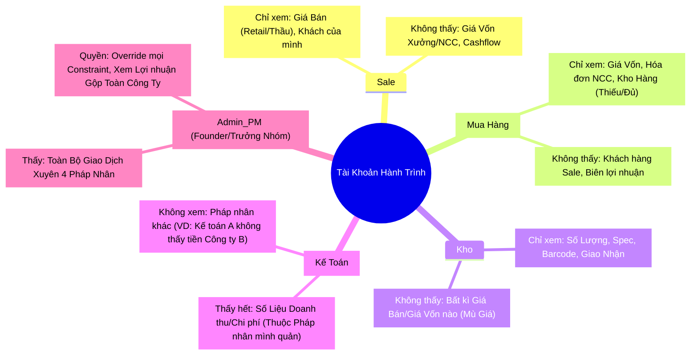
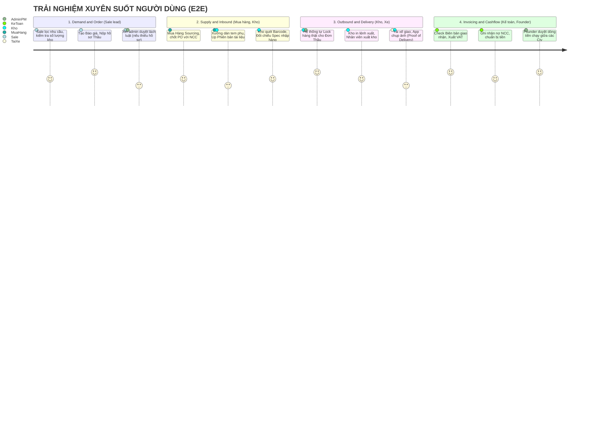
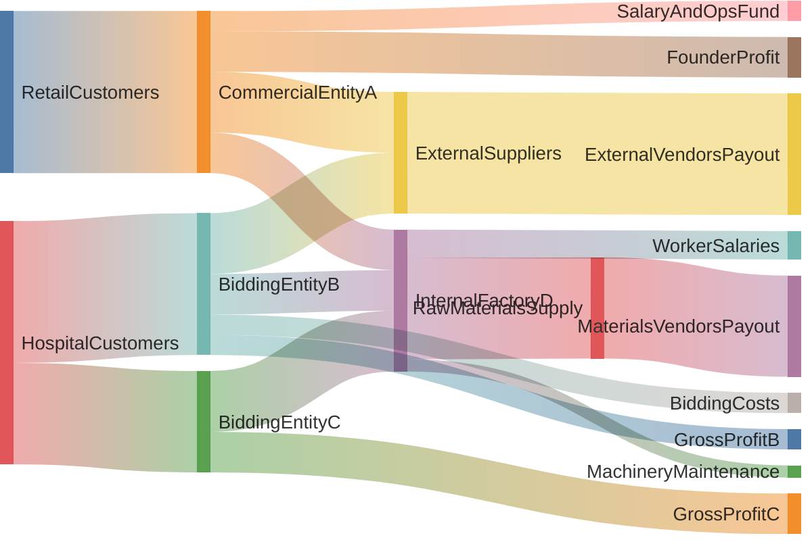
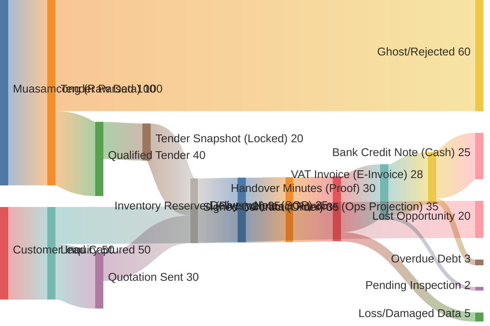

# Hành trình Người dùng & Phân Quyền (Người / Role)

Tài liệu này dùng để thiết kế **Màn hình Frontend + Backend Security** cho Founder. Mỗi bộ phận sẽ có User Journey riêng biệt (chúng bị chặn bằng Workflow Event + Constraint) + Quy tắc bảo mật Data ngặt nghèo.

---

## 🧭 Ma Trận Quyền (Role & Permissions Core)

---

## 🚀 HÀNH TRÌNH TỔNG THỂ (E2E UNIFIED JOURNEY)

Bản đồ dưới đây mô tả sự tiếp nối liền mạch giữa các bộ phận, từ lúc Sale chốt đơn cho đến lúc Kế toán thu tiền. Khi một bộ phận hoàn thành thẻ công việc, dữ liệu tự động rẽ nhánh sang màn hình của bộ phận tiếp theo.

---

## CHI TIẾT MÀN HÌNH HÀNH ĐỘNG (DÀNH CHO CODER)

### 1. 🙍‍♂️ Hành trình Sale (Sales Journey)

* **Goal:** Chốt Thầu, Chốt Đơn.
* **Journey (Màn Hình Thấy):**
  1. `[Dashboard]` Tìm và lọc nhu cầu Khách/Thầu.
  2. `[Catalog]` Nhập SP cần bán -> Hệ thống báo Số Lượng có sẵn. (Tuyệt đối **không hiển thị** vốn nhập từ NCC bao nhiêu).
  3. `[Builder]` Tạo Báo giá -> Tạo Báo Giá / Tham gia Thầu.
  4. `[Document Vault]` Tải file Spec/Hướng dẫn từ thư viện lên Hồ Sơ -> *Submit xin Duyệt*.
  5. `[Trạng Thái]` Xem tiến độ Mua Hàng/Kho lấy hàng (Chỉ Status: "Đang mua", "Đã về", "Đã đi").

---

### 2. 🕵️ Hành trình Mua Hàng / Xưởng (Purchase/Production)

* **Goal:** Chuẩn bị hàng, Xoay hàng đúng Spec cho Sale.
* **Journey:**
  1. `[Request Inbox]` Nhận yêu cầu "Cần xx Hàng Y" từ Sale.
  2. `[Sourcing]` Lên PO mua từ NCC Nước Ngoài (Hiển thị Lịch sử giá nhập, Giá Vốn).
  3. `[Document]` Xin Bản Dịch, in Tem (Version B, C) nếu là hàng thầu đặc biệt -> Upload lại vào hệ thống.
  4. `[Tracking]` Cập nhật ngày hàng về dự kiến.

---

### 3. 📦 Hành trình Kho & Vận Chuyển (Warehouse & Delivery)

* **Goal:** Nhập/Xuất đúng Lô/ISO, Giao Đúng Hẹn.
* **Journey:**
  1. `[Inbound]` Hàng cập bến -> Quét Mã Barcode -> Đối chiếu Spec Giấy tờ. (Mù 100% Giá tiền, chỉ thấy số lượng nhập).
  2. `[Reservation]` Hệ thống tự Lock 50 Hàng cho Đơn Thầu A. Kho không được lấy xuất cho đơn Thương mại B.
  3. `[Outbound]` In Phiếu Giao / Lệnh Xuất.
  4. `[App Giao Hàng]` Nhân viên chở đi, Khách nhận hàng -> Chụp ảnh/Ký Biên Bản trên App Tài xế -> Bấm "Hoàn Tất" -> Document lưu vào Backend tự động.
  5. `[Return Handling]` Nhận hàng trả về -> Kiểm tra Condition -> Bấm `Restock` hoặc `Dispose`.
  6. `[Stock Transfer]` Màn hình điều chuyển kho -> Chọn Lô -> Chọn Kho Đích -> Bấm `Ship`.

---

### 4. 👩‍💼 Hành trình Kế Toán (Accounting/FMS)

* **Goal:** Xuất VAT đúng lúc, Rót tiền trả nợ, Cập nhật trạng thái Thu/Chi.
* **Journey:**
  1. `[Billing]` Cảnh báo Đỏ hiển thị nếu Sale đòi xuất Hóa Đơn khi Biên Bản Giao Nhận chưa được tài xế Upload.
  2. `[Invoicing]` Nhận Noti "Đã Giao Xong" -> Kế Toán Click Gửi VAT cho Khách.
  3. `[Payable]` Lên danh sách NCC sắp đến hạn thanh toán trong Pháp Nhân A. Xin Founder Cấp tiền.
  4. `[Receivable]` Báo Đỏ Khách Hàng Nợ Lâu. Trừ Điểm Tín Dụng Khách Hàng.
  5. `[Credit Note]` Duyệt hoàn tiền từ `ReturnOrder` -> Xuất hóa đơn điều chỉnh giảm.

---

### 5. 👑 Hành trình Admin/Founder (Mắt Đại Bàng)

* **Goal:** Điều tiết, Vá Lỗi, và Đọc Dòng Tiền.
* **Journey:**
  1. `[God Mode Dashboard]` Xem biểu đồ Sankey luân chuyển tiền mặt giữa 4 Cty (A, B, C, D).
  2. `[Approval]` Màn hình hiện thông báo Xin Duyệt (Sale chưa đủ giấy tờ thầu xin phép lách để đi nộp trước, Mua Hàng xin vượt ngân sách).
  3. `[Inter-company Transfer]` Founder kéo thả tiền từ Túi Thương Mại A sang tài trợ vốn cho Xưởng D. Tiền trong hệ thống Ghi sổ nội bộ cập nhật tức thì.

---

## Tóm Tắt cho Coder

1. Mọi API phải kèm cơ chế `Role-Based Route Guard`.
2. Truy vấn Database luôn lọc theo `Legal_Entity_ID` (Trừ Admin).
3. Payload trả về Frontend (VD lúc GET Data Product cho Sale) dứt khoát KHÔNG có trường `CostPrice`.

## TỔNG HỢP CÁC TRƯỜNG HỢP NGOẠI LỆ (EVERY EDGE CASES)

> **📌 Model Reference:** Constraint logic chi tiết tại [constraints.yaml](../model/constraints.yaml), State Machine tại [states.yaml](../model/states.yaml).
> Tài liệu này bổ sung **ngữ cảnh thực tế** mà các rule đang bảo vệ — để Dev hiểu *tại sao* constraint tồn tại.

---

### 1. 🟨 INVENTORY EXCEPTIONS (Lỗi Kho & Nguồn Cung)

| Case | Tình huống | Xử lý | Ref |
| :--- | :--- | :--- | :--- |
| **Stockout after Confirm** | Đã `ConfirmContract` nhưng kho thực tế thiếu (hỏng/mất). | REJECT → Order về `Failed/Adjustment Required`. Notify Sale & Procurement. | States: `InventoryLot` |
| **Reserved but Expired** | Hàng lock cho Order A nhưng mãi không ship (om hàng). | Auto-Release sau X ngày. | `C-INV-002` |
| **Inbound Spec Mismatch** | Hàng NCC giao không khớp Spec trong PO. | REJECT Inbound. Không cho `ReceiveGoods`. | `C-INV-001` |

---

### 2. 🟪 FINANCE & PAYMENT EXCEPTIONS (Lỗi Dòng Tiền)

| Case | Tình huống | Xử lý | Ref |
| :--- | :--- | :--- | :--- |
| **Hard Overdue Debt** | Khách nợ > 30 ngày, muốn đặt đơn mới. | HARD REJECT `ConfirmContract`. Chỉ Founder Overrule. | `C-ORD-005` |
| **VAT Invoice Modification** | Sai thông tin trên VAT E-Invoice cần hủy/xuất lại. | Cancel & Reissue. Invoice cũ → `Voided`, link bản mới. | `C-FIN-002` |
| **Partial Payment** | Khách chỉ trả 70%. | Trừ credit limit. Order → `PartiallyPaid`. | States: `Invoice` |

---

### 3. 🟥 DELIVERY & DOCUMENTS EXCEPTIONS (Lỗi Thực Địa)

| Case | Tình huống | Xử lý | Ref |
| :--- | :--- | :--- | :--- |
| **Partial Acceptance** | Khách chỉ ký nhận 8/10 món. | Split Delivery → `PartiallyDelivered`. Tạo đơn Replacement. | States: `Delivery` |
| **Lost Physical Document** | Tài xế mất biên bản mộc đỏ. | Block `IssueInvoice` đến khi upload bản ký lại. | `C-FIN-001` |
| **Delivery To Wrong Station** | GPS lệch xa so với địa chỉ Order. | Block `CompleteDelivery`. Yêu cầu xác thực bổ sung. | `C-DEL-002` |

---

### 4. 🟩 ORDER & TENDER EXCEPTIONS (Lỗi Chốt Deal)

| Case | Tình huống | Xử lý | Ref |
| :--- | :--- | :--- | :--- |
| **Price Slippage** | Giá đầu vào tăng sau khi trúng thầu → lỗ. | Order → `Flagged/Risk`. Founder phải duyệt lỗ. | `C-ORD-006` |
| **Tender Submission Failure** | Lỗi kỹ thuật không nộp được thầu. | Log `SubmitTender(Fail)`. Chuyển sang `Abandoned`. Archive docs. | States: `Order` |

---

### 5. 🟦 RMA & RETURN EXCEPTIONS (Lỗi Trả Hàng)

| Case | Tình huống | Xử lý | Ref |
| :--- | :--- | :--- | :--- |
| **Good Condition Return** | Khách trả hàng do đổi ý, hàng còn nguyên seal. | Kho `ApproveReturn`, kích hoạt `ProcessRestock`. Tăng `Available` qty. | States: `ReturnOrder` |
| **Defective Return** | Khách trả hàng do hỏng/lỗi kỹ thuật. | `ReturnLineItem` được kích hoạt `ProcessDispose`. Giảm tồn kho. | `C-INV-001` |
| **Refund Validation** | Hoàn tiền cho khách. | Kế toán duyệt `CompleteRefund`. Sinh Credit Note. | `C-FIN-002` |

---

### 6. 🟩 STOCK TRANSFER LOGIC (Điều Chuyển Kho)

| Case | Tình huống | Xử lý | Ref |
| :--- | :--- | :--- | :--- |
| **Internal Rebalance** | Chuyển hàng từ DC về Satellite Depot. | `ShipTransfer` (Source -) -> `ReceiveTransfer` (Dest +). | States: `StockTransfer` |
| **Traceability Preservation** | Truy vết lô hàng sau khi chuyển kho. | `StockTransferLine` giữ nguyên `lot_id`. Chỉ cập Nhật `warehouse_id`. | `C-INV-003` |
| **Spec Refinement** | Hàng nhập về cần tinh chỉnh (tem/cấu hình) để khớp thầu. | Kho/Xưởng thực hiện `RefineBatchSpec`. Hệ thống đối soát thầu + pháp lý. | `C-INV-005` |

---

### 7. 🟧 POST-AWARD EXECUTION & COMMERCIAL (Sau trúng thầu / Giá / AR)

| Case | Tình huống | Xử lý | Ref |
| :--- | :--- | :--- | :--- |
| **Late vs lead time** | Mốc giao line gần hơn lead time NCC còn lại. | Cảnh báo `line_risk_level`; tạo `ExecutionIssue` loại Delay. | `C-EXE-001` |
| **Financing gap** | Tổng chi 14 ngày tới vượt hạn mức vốn vận hành. | Cảnh báo; Founder/Finance điều chỉnh `CashPlanEvent` hoặc nguồn. | `C-EXE-002` |
| **Issue hồ sơ mở khi giao** | Còn issue DocMissing/Quality mở trên dòng hàng. | Cảnh báo trước `StartDelivery`; waiver + AuditLog nếu bắt buộc. | `C-EXE-003` |
| **Mốc thu sắp đến, checklist thiếu** | `PaymentMilestone` gần hạn mà chưa đủ chứng từ mốc. | Cảnh báo payment-ready; không thay thế `C-FIN-001`. | `C-EXE-004` |
| **Aging & nợ** | Hóa đơn quá `payment_due_date`. | Job cập nhật `days_overdue_cached`, đồng bộ với chặn đơn. | `C-AR-001`, `C-ORD-005` |
| **Giá lệch bảng** | Giá chốt lệch đáng kể so với `PriceList` kênh. | Yêu cầu ghi nhận duyệt / Founder flag. | `C-PR-001` |
| **Lô sắp hết hạn** | Reserve gần `expiry_date`. | Cảnh báo FEFO / xả tồn. | `C-INV-006` |

---

> 🧠 **Nguyên tắc:** "Hệ thống chỉ mạnh khi nó biết xử lý lúc yếu nhất." Bảng trên là checklist cho Dev khi viết `try/catch`, `if/else`.

## 📊 DÒNG TIỀN & ĐIỀU CHUYỂN NỘI BỘ (SANKEY DIAGRAM)

Biểu đồ này dành cho Founder nhìn thấy **Dòng tiền chảy** (Cashflow) từ Khách hàng vào các pháp nhân, chảy qua xưởng (chi phí nội bộ) và chảy ra ngoài (Nhà cung cấp, Thuế, Lương).
*Lưu ý: Mermaid dùng chuẩn `sankey-beta`, mỗi dòng là `Nguồn, Đích, Giá trị (Tương đối)`.*

### Giải thích cho Founder

* Trực quan hóa **Internal Transfer Pricing (Giá chuyển nhượng nội bộ)**: Pháp nhân Thương mại/Thầu bản chất đang "mua" hàng từ Pháp nhân Xưởng. Dòng tiền lưu chuyển giữa chúng là doanh thu nội bộ.
* Xưởng không nhận tiền trực tiếp từ Khách mà sống bằng đơn hàng từ Pháp nhân thương mại, tránh rủi ro pháp lý.
* Dễ dàng nhìn thấy "Nút thắt cổ chai" dòng tiền đang kẹt ở đâu (Vd: Pháp nhân B đang ôm nhiều tiền thầu nợ chưa trả NCC).

## ⚡ SANKEY: LUỒNG DỮ LIỆU THỰC THỂ (DATA ENTITY FLOW)

Biểu đồ mô tả sự biến đổi từ các thực thể dữ liệu thô (Leads/Tenders) thành các thực thể vận hành chính thức và cuối cùng là các dữ liệu hạch toán.

## 💡 Ý nghĩa dữ liệu

* **Hao hụt dữ liệu (Ghost/Lost):** Hệ thống phải track được tại sao Tender/Lead bị rớt để làm báo cáo Win/Loss Rate (Tỷ lệ thắng thầu).
* **Điểm nghẽn chứng từ (Document Choke):** Nếu mũi tên từ `Delivery Note` sang `Handover Minutes` bị thắt lại, nghĩa là hàng đi rồi nhưng nhân viên không mang được biên bản mộc đỏ về. Đây là rủi ro pháp lý cực lớn.
* **Data Lineage (Truy vết nguồn gốc):** Từ một `Bank Credit Note` (tiền về), hệ thống phải trace ngược lại được bộ `Handover Minutes`, `Delivery Note`, và `Signed Contract` ban đầu.
