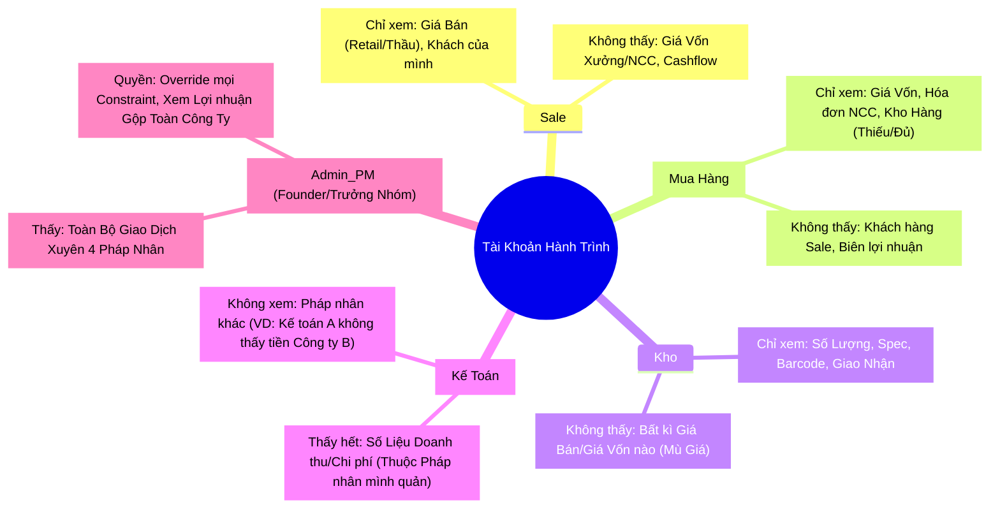
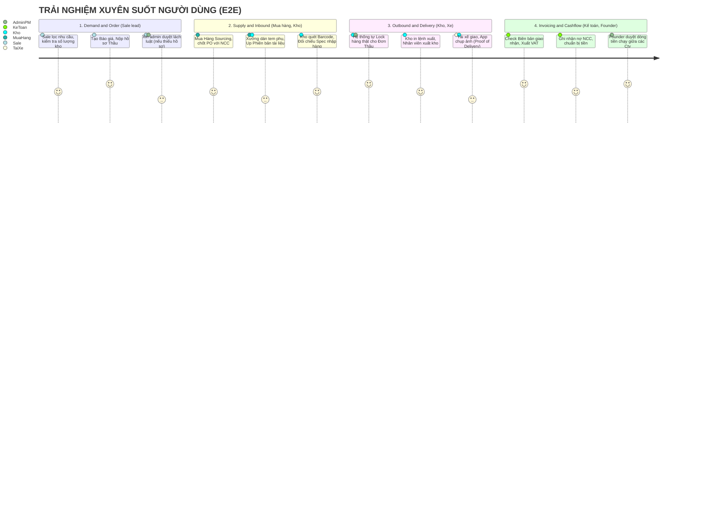
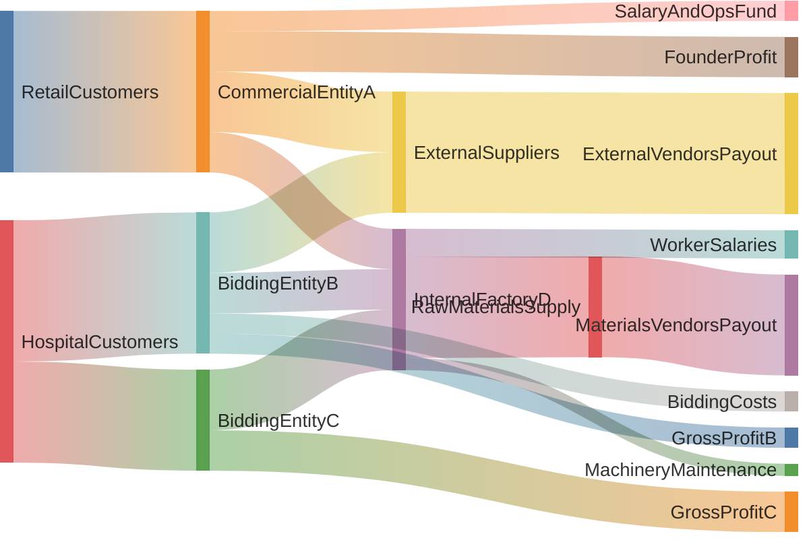
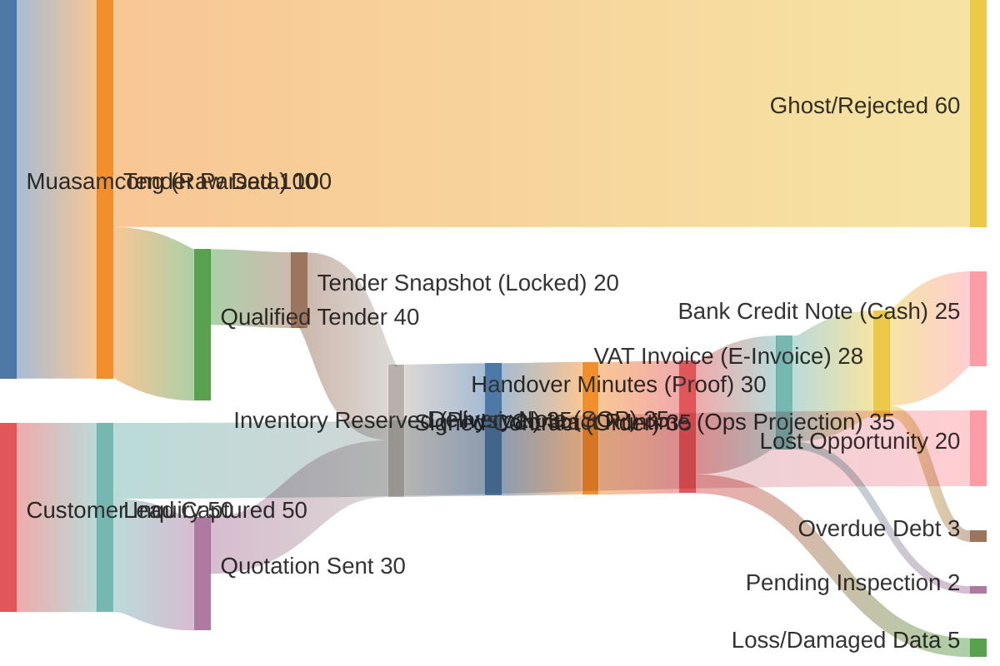

# Tài liệu vận hành (gom)

> **Một file:** North Star, roadmap, ma trận Ops (`C-*`), backlog, runbook, hành trình UX. Blueprint sâu + ERD — [`system_architecture.md`](system_architecture.md). SSOT kỹ thuật: `model/*.yaml`.

---

## Layered flexibility & SSOT (Ops)

**Ma trận chi tiết `C-*` ↔ code:** [`doc/ops_constraints_matrix.md`](ops_constraints_matrix.md).

### Layer 1 — explore (Excel / export)

- Phân tích sâu (pivot, what-if) dùng **CSV export** từ màn Ops (ví dụ Supplier selection analysis), rồi mở trong Excel.
- **Quyết định chốt** (NCC, giá, trạng thái đơn, ledger) phải qua **DB** và validate/transform trong domain — không lưu “công thức lạ” không kiểm soát (FVTPP).

### Layer 2 — optional (preset, template)

- **Ma trận so sánh NCC:** bộ lọc (highlight, ẩn NCC, thứ tự cột) được **lưu trong session** giữa các lần mở trang (`shouldPersistTableFiltersInSession` trên [`SupplySelectionAnalysis`](../app/Filament/Ops/Pages/SupplySelectionAnalysis.php)).
- **Template đơn mua / saved view đa user:** backlog; khi cần scale — có thể thêm bảng preset JSON hoặc master template; generate/copy qua [`GenerateSupplyOrderFromOrderService`](../app/Domain/Supply/GenerateSupplyOrderFromOrderService.php).

### Layer 3 — governance

- Gate `warn` / `hard` trong [`config/ops.php`](../config/ops.php); override có audit ([`GateOverrideService`](../app/Domain/Execution/GateOverrideService.php)); ledger; snapshot immutable; [`AuditLog`](../app/Filament/Ops/Resources/System/AuditLogResource.php).

### Grid / công thức trong trình duyệt

- Chỉ đầu tư khi có **metric** nghiệp vụ (lỗi nhập, paste hàng loạt, thời gian). Mặc định: **export-first**.

### Drift blueprint vs code

- [`system_architecture.md`](system_architecture.md) và bảng *Đối chiếu blueprint vs codebase* dưới đây là **mục tiêu / phạm vi**; không phải mọi màn đã ship 100%.
- Khi app custom lệch mô tả: **cập nhật guide hoặc `model/`** (một SSOT) rồi mới bổ sung code — tránh ba nguồn mâu thuẫn.
- **Đối chiếu tự động:** `python3 scripts/audit_doc_model_consistency.py` (ERD ↔ `entities.yaml`, tham chiếu `C-*` trong doc ↔ `constraints.yaml`).
- **State runtime ↔ canonical:** [`model/order_state_mapping.yaml`](../model/order_state_mapping.yaml) + [`OrderState`](../app/Domain/Demand/OrderState.php); test [`OrderStateMappingConsistencyTest`](../tests/Unit/Domain/OrderStateMappingConsistencyTest.php).

---

## North Star — trạng thái đối chiếu repo

Tài liệu này chốt **5 điều kiện** hoàn thành Business OS (đối chiếu phần **Implementation Roadmap** ngay sau đây) và ghi **gap** còn lại tại thời điểm cập nhật.

## 1. `Order` là aggregate root theo `model/states.yaml`

| Tiêu chí | Trạng thái | Ghi chú |
| --- | --- | --- |
| State runtime lưu DB (chuỗi command) | **Đạt** | `orders.state`: `SubmitTender`, `AwardTender`, … — xem [`app/Models/Demand/Order.php`](../app/Models/Demand/Order.php) |
| Ánh xạ runtime ↔ canonical (YAML) | **Đạt** | [`model/order_state_mapping.yaml`](../model/order_state_mapping.yaml) + [`app/Domain/Demand/OrderState.php`](../app/Domain/Demand/OrderState.php) |
| Chuyển trạng thái qua service, không bypass | **Đạt** | `Order::transitionTo` chỉ khi `allowStateMutation`; luồng chính qua [`OrderTransitionService`](../app/Domain/Demand/OrderTransitionService.php) và command services |
| Khớp đầy đủ mọi transition trong `states.yaml` | **Một phần** | YAML mô tả thêm nhánh (ví dụ `Draft` → …); runtime mặc định `SubmitTender` khi tạo order — đã có ghi chú trong YAML. Không cần đổi DB nếu mapping + tài liệu đủ |

**Gap:** Nếu sau này cần state `Draft` riêng trên DB, cần migration + backfill + cập nhật mapping.

---

## 2. Luồng dọc Demand → Supply → Inventory → Delivery → Cash

| Tiêu chí | Trạng thái | Ghi chú |
| --- | --- | --- |
| Test tích hợp happy path + gate fail | **Đạt** | [`tests/Feature/Ops/ExecutionPlanFlowTest.php`](../tests/Feature/Ops/ExecutionPlanFlowTest.php) (snapshot → contract → order transitions → supply → reserve → delivery → invoice → ledger, v.v.) |
| Phase B/C/D có bằng chứng trong test | **Đạt** | Cùng file: confirm contract, fulfillment, invoice rejection, C-ORD-005, return/transfer, … |

**Gap:** UI journey theo role (Sale/MuaHang/…) vẫn tập trung Filament Ops — xem section *Backlog — UX Filament* ở dưới.

---

## 3. Constraint `C-*` có enforcement (hard hoặc warn + audit)

| Tiêu chí | Trạng thái | Ghi chú |
| --- | --- | --- |
| Gate warn/hard có config | **Đạt** | `config/ops.php`, [`GateEvaluator`](../app/Domain/Execution/GateEvaluator.php), override + audit |
| Ví dụ hard: C-ORD-005 | **Đạt** | [`CustomerCreditGuard`](../app/Domain/Demand/CustomerCreditGuard.php) + test tên constraint |
| Ví dụ warn: C-PR-001, fulfillment | **Đạt** | [`OrderTransitionService::buildWarnings`](../app/Domain/Demand/OrderTransitionService.php) |

**Gap:** Không phải mọi dòng `constraints.yaml` đã có service riêng — ưu tiên theo section *Ma trận Ops* và edge cases trong section *Hành trình Người dùng* (cùng file, phía dưới).

---

## 4. ERD / `entities.yaml` đồng bộ với tài liệu

| Tiêu chí | Trạng thái | Ghi chú |
| --- | --- | --- |
| Script audit pass | **Đạt** | `python3 scripts/audit_doc_model_consistency.py` (ERD vs `entities.yaml`, constraint refs trong doc) |
| CI | **Đạt** | [`.github/workflows/ci.yml`](../.github/workflows/ci.yml) chạy audit trước test pack |

**Migration / schema lớn:** xem section *Runbook — migration* ở dưới.

---

## 5. Mỗi domain chính: test happy path + failure gates

| Domain | Trạng thái | Ghi chú |
| --- | --- | --- |
| Demand / Order | **Đạt** | Transition matrix, confirm reject, C-ORD-005 |
| Execution / Gate | **Đạt** | Pre-delivery, pre-payment, override |
| Supply / Inventory | **Đạt** | Reserve, transfer, return (theo scenario trong `ExecutionPlanFlowTest`) |
| Finance | **Đạt** | Issue invoice, milestone, aging |

**Gap bổ sung:** Đồng bộ cơ học `OrderState` ↔ `order_state_mapping.yaml` được khóa bằng [`tests/Unit/Domain/OrderStateMappingConsistencyTest.php`](../tests/Unit/Domain/OrderStateMappingConsistencyTest.php).

---

## Tích hợp ngoài (không thuộc North Star)

MISA, VA/LLM, Tender Intelligence: theo section *Post-MVP* ở dưới.

## Blueprint sâu (không chặn North Star)

ROP/ABC đầy đủ, priority engine, reserve TTL cron, logistics slice: section *Backlog — blueprint sâu* ở dưới.

---

## Implementation Roadmap (Business OS Build Path)

Mục tiêu: biến `model/*` + tài liệu trong `doc/` thành backlog có thứ tự để build được **toàn bộ Business OS**, không chỉ Ops runtime.

Nguyên tắc nền (ref: [`system_architecture.md`](system_architecture.md))
- **Model-first**: sửa `model/*` trước, app theo sau.
- **Event + Constraint = Physics**: không đi state bằng UI tắt.
- **Document là Proof**: điều kiện mở cổng state.
- **Human-in-the-loop**: máy gợi ý, người confirm.
- **Backward-compatible rollout**: ưu tiên add, không phá flow đang chạy.

### Đối chiếu với [`system_architecture.md`](system_architecture.md)

- **`system_architecture.md`** mô tả **toàn bộ** Business OS (Knowledge, từng layer, Planning/Logistics, EventBus, MISA, webhook ngân hàng, …). Đó là **North Star / blueprint**, không phải checklist “đã xong” cho mỗi PR.
- **File roadmap này** là **đường build có phase**: “đủ” được đo theo **North Star (5 điều kiện)** và **definition of done từng phase** (A → E), không yêu cầu khớp 100% blueprint trước khi Phase D/E ổn định.
- Khi cần hỏi “đã đủ chưa?”, ưu tiên: (1) phase hiện tại trong bảng dưới, (2) khối **North Star**, (3) tích hợp ngoài / Intelligence nằm trong section *Post-MVP* ở trên sau MVP Ops.

### Ưu tiên build hiện tại (logic doanh nghiệp trước)

- **Trọng tâm:** `Order` / constraint / gate / ledger / projection **nhất quán** với `model/*` và test tích hợp — đây là nền bắt buộc trước khi mở rộng UX hay Intelligence.
- **Hoãn chủ động:** tích hợp **MISA**, **webhook ngân hàng / VA**, và các adapter bên ngoài khác — giữ **port + null adapter** trong code để dev không phụ thuộc vendor; không ưu tiên triển khai production cho các kênh này cho đến khi nội bộ đã “chặt”. Chi tiết hoãn xem section *Post-MVP* ở dưới.

---

## Trạng thái hiện tại

Đối chiếu chi tiết 5 điều kiện North Star với repo (gap từng mục): phần North Star ở đầu file này.

Đã có nền Ops runtime và slice hậu trúng thầu:
- `TenderSnapshot` + Lock + Generate plan
- `Contract`, `ContractItem`, `Document`, `PaymentMilestone`, `ExecutionIssue`, `CashPlanEvent`
- Risk cache/dashboard, gate warn-first, audit trail nền

Khoảng trống còn lại (sau Phase A–C trong code):
- `model/states.yaml` (tên state canonical) có thể lệch chuỗi state runtime (`Order` trong DB) — cần đồng bộ một lần (Phase E / hygiene).
- CI mặc định: chạy `tests/Feature/Ops` (xem workflow) để khóa regression; chạy `scripts/audit_doc_model_consistency.py` trên PR.
- Reserve inventory: TTL/cron release (tùy chọn, sau Delivery/Cash ổn định).

---

## North Star: Full Business OS

Done khi đạt đủ 5 điều kiện:
1. `Order` là aggregate root thật sự theo `model/states.yaml`.
2. Mọi domain chính chạy được theo luồng dọc: Demand -> Supply -> Inventory -> Delivery -> Cash.
3. Constraint IDs trong `model/constraints.yaml` có enforcement rõ (hard hoặc warn+audit).
4. ERD trong [`system_architecture.md`](system_architecture.md) và `model/entities.yaml` luôn đồng bộ (audit script pass).
5. Mỗi domain có test tích hợp tối thiểu cho happy path + failure gates.

---

## Bảng đối chiếu blueprint vs codebase

Hai tài liệu [`system_architecture.md`](system_architecture.md) và section *Hành trình Người dùng* bên dưới là **North Star / UX target** — không phải trạng thái “đã ship 100%”. Bảng dưới ước lượng **mức đã gắn với code** tại thời điểm cập nhật roadmap.

**Chú thích cột Trạng thái**

| Ký hiệu | Ý nghĩa |
| --- | --- |
| **Đủ** | Có phần lõi trong app (domain + persistence + thường có test Ops) — đủ vận hành MVP/Filament. |
| **Một phần** | Có slice hoặc gate/warn; thiếu journey UI đầy đủ hoặc tính năng phụ trong doc. |
| **Chưa** | Chủ yếu còn trên paper / backlog (xem section *Post-MVP* nếu liên quan tích hợp ngoài). |

### [`system_architecture.md`](system_architecture.md) — các khối kiến trúc

| Khối / mục (tham chiếu doc) | Trạng thái | Ghi chú ngắn |
| --- | --- | --- |
| §0 Knowledge (Canonical Product, Tender Intelligence) | **Một phần** | Bảng `canonical_products` + upsert; chưa LLM/vector/normalize file như doc. |
| §1 Demand & Contract (`Order`, snapshot, state) | **Đủ** | Snapshot lock, plan, transition command, map runtime ↔ canonical (`model/order_state_mapping.yaml`). |
| §2 Inventory (`InventoryLot`, reserve, priority…) | **Một phần** | Nhận kho, reserve + TTL, transfer, return; chưa “priority engine” đầy đủ như mô tả. |
| §3 Delivery (thực địa, proof, GPS…) | **Một phần** | `Delivery`, vehicle/route, gate pre-delivery; chưa app tài xế / GPS cứng `C-DEL-002`. |
| §4 Cashflow (Invoice, ledger, MISA, VA) | **Một phần** | Issue invoice, ledger, milestone, aging; **MISA/VA** hoãn — port + null adapter. |
| §4b Post-award (Contract runtime, milestone, issue, price, touchpoint) | **Đủ** / **Một phần** | Projection + `SalesTouchpoint`; cash plan / gap vốn có thể mỏng hơn doc. |
| §5 Engineering core (Command → Constraint → Audit) | **Đủ** | `GateEvaluator`, audit, policy; EventBus đầy đủ như doc là mục tiêu dài hạn. |
| Planning / Logistics / ROP (`ops:rop-scan`, ABC…) | **Một phần** | Scan ngưỡng + audit; chưa ABC/Product class đầy đủ trong model app. |
| Tích hợp ngoài (MISA, webhook ngân hàng) | **Chưa** (hoãn) | Theo section *Post-MVP* trong file này. |

### Hành trình & ma trận (đối chiếu `business_workflows`)

| Mục trong doc | Trạng thái | Ghi chú ngắn |
| --- | --- | --- |
| Ma trận quyền (Sale / MuaHang / Kho / KeToan / Admin) | **Một phần** | Section *Ma trận Ops* bên dưới + Filament + `LegalEntity` scope; chưa tách app riêng từng vai. |
| Hành trình E2E (4 section journey) | **Một phần** | Luồng dọc **Demand → … → Cash** có test tích hợp; chưa UI journey riêng từng bộ phận. |
| Sale: Catalog / Builder / Document Vault | **Chưa** | Thay bằng Order / Contract / Snapshot trong Ops. |
| Mua hàng: Request Inbox / Sourcing PO | **Một phần** | Supply order từ thiếu hàng + Filament; chưa inbox/workflow đầy đủ. |
| Kho: Inbound quét barcode / App POD | **Một phần** | Nhập nhận qua domain; chưa app mobile POD như doc. |
| Kế toán: Billing đỏ / Payable list / Credit note đầy đủ | **Một phần** | Xuất HĐ + milestone + aging; payable/credit note mở rộng theo nhu cầu. |
| Founder: Sankey / Inter-company transfer | **Chưa** | Dashboard tiền mặt như mô tả chưa có. |
| Bảng edge cases + `C-*` | **Một phần** | Chi tiết enforce: section *Ma trận Ops* §2; không phải mọi dòng edge case đã có code. |

**Kết luận ngắn:** Blueprint và journey **đã định hướng** và **đã khớp một phần lớn** với Phase A–E trong repo; **chưa** đồng nghĩa mọi màn hình và tích hợp trong hai file đã sẵn sàng vận hành production đầy đủ.

---

## Phase A — Stabilize Foundation (**đã triển khai trong code**)

### Mục tiêu
Chốt nền post-award để làm bệ phóng cho full OS.

### Scope (trạng thái)
- `TenderSnapshot` immutable + hash/version — **có** (`TenderSnapshot::lock`, hash payload).
- `GenerateExecutionPlan` — **có** (transaction, contract + items + milestone + audit).
- Gate pre-activate / pre-delivery / pre-payment warn-first + override audit — **có** (`GateEvaluator`, `GateOverrideService`).
- `AuditLog` — **có** (`AuditLogService`, Filament).

### Deliverables
- Resource UI Snapshot/Contract/Audit — **có** (Filament Ops).
- Feature tests luồng Snapshot → Runtime — **có** (`tests/Feature/Ops/ExecutionPlanFlowTest.php`); CI chạy gói Ops (workflow).

### Gap nhỏ
- Tiếp tục ưu tiên migration **additive** khi mở rộng schema.

---

## Phase B — Core Demand OS (`Order` as Aggregate Root) (**lõi đã có**)

### Mục tiêu
Đưa toàn bộ nghiệp vụ về trục `Order`/`OrderItem`.

### Map sang model
- Entities: `Order`, `OrderItem`, `Tender`, `TenderItem`, `SalesTouchpoint`, `PriceList`, `PriceListItem`
- States/events: `SubmitTender`, `AwardTender`, `ConfirmContract`, `StartExecution`, `ConfirmFulfillment`, `CloseContract`, `AbandonTender`
- Constraints: ưu tiên `C-ORD-*`, các ràng buộc credit/docs liên quan

### Build steps
1. Dựng state transition service cho `Order` (hard guard cho invalid transitions).
2. Nối `Tender/TenderItem` -> `Order/OrderItem` bằng command rõ input/output.
3. Tích hợp pricing (`PriceList/PriceListItem`) vào lúc chốt order lines.
4. Tích hợp `SalesTouchpoint` để không mất handover context.
5. Giảm dần nhập trực tiếp `Contract`; `Contract` chỉ còn projection.

### Acceptance
- Tạo/chuyển trạng thái order không bypass được constraints chính — **có** (`Order::transitionTo` + command services).
- Trace `Order` ↔ `Contract` — **có** (projection + tests).
- **Note:** tên state trong `model/states.yaml` (Draft, BidSubmitted, …) có thể khác chuỗi runtime (`AwardTender`, `ConfirmContract`, …) — reconcile trong Phase E.

---

## Phase C — Supply + Inventory OS (**đã có service + test**)

### Mục tiêu
Nối được nhu cầu mua hàng và tồn kho theo đúng physics.

### Map sang model
- Entities: `SupplyOrder`, `InventoryLot`, `InventoryReservation`, `InventoryLedger`, `StockTransfer`, `StockTransferLine`, `ReturnOrder`, `ReturnLineItem`
- Constraints: nhóm `C-SUP-*`, `C-INV-*`

### Build steps
1. `OrderItem` -> `SupplyOrder` (khi thiếu nguồn hàng).
2. Nhập kho tạo `InventoryLot` + append `InventoryLedger`.
3. Reserve theo `InventoryReservation` (lock/release rõ rule).
4. Điều chuyển kho với `StockTransfer`.
5. Quy trình return/re-stock/dispose.

### Acceptance
- Ledger IN/OUT/RESERVE — **có** (`InventoryLedger`, services).
- Reserve release / over-reserve — **có test**; TTL tự động — tùy chọn sau này.
- Thiếu hàng, transfer — **có test** trong `ExecutionPlanFlowTest`.

---

## Phase D — Delivery + Cash OS (**đã đạt acceptance tối thiểu trong code**)

### Mục tiêu
Hoàn tất vòng thực thi từ giao hàng đến hóa đơn/thu tiền.

### Map sang model
- Entities: `Delivery`, `DeliveryRoute`, `Vehicle`, `Invoice`, `Ledger`, `PaymentMilestone`, `Document`
- Constraints: nhóm `C-DEL-*`, `C-FIN-*`, `C-AR-*`, `C-EXE-*`

### Build steps
1. Dispatch delivery từ order/runtime projection.
2. Enforce proof docs trước milestone/payment readiness.
3. Issue invoice theo điều kiện giao hàng/chứng từ.
4. Ghi nhận ledger inflow/outflow/internal transfer.
5. Cảnh báo overdue/AR aging + cash gap.

### Acceptance (**đã có test + widget; mở rộng tiếp theo nhu cầu nghiệp vụ**)
- Không thể issue invoice khi thiếu điều kiện — **có** (`IssueInvoiceService` + `FulfillmentReadiness`; `tests/Feature/Ops/ExecutionPlanFlowTest.php`: reject khi thiếu giao/chứng từ; reject khi giao chưa `Delivered`).
- Payment readiness đi qua checklist rõ ràng — **có** (`GateEvaluator::evaluatePrePayment`, checklist milestone; cùng file test: gate pre-payment + milestone).
- Dashboard tài chính phản ánh đúng aging/gap — **có** (`OpsDebtAndLedgerKpiWidget` gom AR + ledger, `MilestoneAgingService`; test refresh `days_overdue_cached`).

### Gap tiếp (không chặn Phase D)
- `DeliveryRoute` / `Vehicle` đầy đủ như ERD: tùy slice logistics sau.
- Cash gap theo `CashPlanEvent`: bổ sung khi cần cảnh báo vốn chi tiết hơn widget hiện tại.

---

## Phase E — Governance, Intelligence, and Hardening (**đã đóng phần tối thiểu trong code**)

### Mục tiêu
Nâng từ MVP vận hành lên hệ thống bền vững.

### Scope
- Chuyển dần warn-first sang hard gate ở constraint critical (config + một số gate).
- Audit command đã có; replay schema — tùy roadmap sau.
- `scripts/audit_doc_model_consistency.py` trong CI.
- Runbook migration lớn — section Runbook ở trên.
- Ma trận quyền + constraint — section *Ma trận Ops* ở trên.

### Trạng thái (đã có)
- **Gates:** `config/ops.php` — `confirm_fulfillment`, `invoice_payment_milestone` (`IssueInvoiceService` + audit khi `warn`).
- **CI:** `.github/workflows/ci.yml` — audit + `tests/Feature/Ops` (và gói stable khác).
- **Runbook:** section Runbook ở trên + checklist backfill / env gate.
- **Ma trận:** section *Ma trận Ops* ở trên, `App\Support\Ops\FilamentAccess` + policy / `canViewAny` trên resource Ops.

### Acceptance
- Enforcement mode rõ cho gate chọn lọc — **có** (env + `config/ops.php`).
- CI: doc/model audit + Ops tests — **có**.
- Runbook có mẫu cho migration/backfill — **có**.

### Gap tiếp (tùy chọn)
- Hard gate thêm cho các bước `GateEvaluator` khác (pre-delivery UI) nếu cần.
- Policy class / Laravel Policy thay cho `canViewAny` trên resource — khi số role phức tạp hơn.

---

## Dependency graph (thứ tự bắt buộc)

1. Phase A -> B (nền runtime + audit xong mới nâng aggregate root).
2. Phase B -> C (có demand chuẩn mới tính supply/inventory đúng).
3. Phase C -> D (delivery/cash phụ thuộc availability + reservation).
4. Phase D -> E (governance/hard gate sau khi luồng chính ổn định).

---

## Work mode đề xuất (để không loạn)

- Luôn triển khai theo **vertical slice**: UI + command/service + persistence + test.
- Mỗi PR chỉ 1 capability rõ (ví dụ: `Order state transition`, `Reserve inventory`, `Issue invoice gate`).
- Không mở domain mới nếu domain trước chưa có test integration pass.
- Mỗi phase đều phải có checklist “definition of done” trước khi qua phase tiếp theo.

---

## “Hôm nay làm gì?”

Thứ tự ưu tiên hiện tại (sau khi A–E đã có phần tối thiểu trong repo):
1. Đồng bộ `model/states.yaml` với runtime `Order` và ma trận ràng buộc `C-*` (enforce + test) — **logic nội bộ nhất quán trước**.
2. Hoàn thiện gate / ledger / luồng dọc theo North Star (reserve TTL, delivery proof, v.v.) khi còn gap.
3. Mở rộng Policy matrix Filament hoặc hard gate thêm nếu nghiệp vụ yêu cầu.
4. **Sau** khi (1)–(3) ổn: Intelligence / tích hợp ngoài — chỉ theo section *Post-MVP* trong file này (MISA, VA, … không blocking).

---

## Ma trận Ops (tổng hợp)

Gộp **ma trận quyền** Filament và **ma trận triển khai constraint** (`C-*`). Cập nhật khi đổi policy, resource, hoặc guard.

---

## 1. Ma trận quyền theo role (Filament Ops)

Role runtime: `Admin_PM`, `Sale`, `MuaHang`, `Kho`, `KeToan` (đồng bộ `User::role` và [`App\Support\Ops\FilamentAccess`](../app/Support/Ops/FilamentAccess.php)). **Order** / **Invoice** dùng Laravel [`OrderPolicy`](../app/Policies/OrderPolicy.php) / [`InvoicePolicy`](../app/Policies/InvoicePolicy.php) (đăng ký trong `AppServiceProvider`) — cùng tập role với bảng dưới.

| Resource / nhóm | Admin_PM | Sale | MuaHang | Kho | KeToan |
| --- | --- | --- | --- | --- | --- |
| Order, Tender Snapshot, Contract, Document, Execution Issue | Có | Có | Có | Có | Có |
| Delivery | Có | Có | Có | Có | Có |
| Payment milestone, Cash plan event | Có | Có | — | — | Có |
| Invoice, Financial ledger | Có | — | — | — | Có |
| Audit log, Users | Có | — | — | — | — |

Ghi chú:

- **Pháp nhân (`User.legal_entity_id`):** `Order` / `Invoice` bị **global scope** theo pháp nhân cho role `Sale`, `MuaHang`, `Kho`, `KeToan`. `Admin_PM` không bị scope; user không gán pháp nhân không thấy đơn/hóa đơn (an toàn mặc định). Gán pháp nhân trong Filament **Users** (Admin).
- **Giá dòng hàng (`OrderItem.unit_price`):** cột/form chỉ hiển thị cho `Admin_PM`, `Sale`, `KeToan` — **Kho** và **MuaHang** không thấy (mù giá kênh bán theo section Hành trình bên dưới).
- **Xóa** hồ sơ (delete) trên một số resource vẫn chỉ `Admin_PM` (ví dụ Invoice, Delivery) — xem `canDelete` từng resource.
- **Cổng nghiệp vụ** (fulfillment, milestone khi xuất HĐ) do `config/ops.php` + domain service, không thay thế ma trận UI.

---

## 2. Ma trận constraint (`C-*`)

Ánh xạ [model/constraints.yaml](../model/constraints.yaml) với code. Trạng thái: **implemented** (hard/warn trong PHP), **partial** (một nhánh hoặc chỉ warn), **not_started** (chưa có service).

| ID | Domain | Status | Where |
| --- | --- | --- | --- |
| C-ORD-001 | Order | partial (warn/hard) | `OrderConstraintChecks` + `config('ops.gates.award_tender_required_docs')` — DOC_HSMT, DOC_HSDT, BL_DU_THAU |
| C-ORD-002 | Order | partial (warn) | `OrderConstraintChecks` — CO-CQ (proxy cert cross-check) |
| C-ORD-003 | Order | partial | HD_KY + credit limit: `OrderConstraintChecks` + `config('ops.gates.confirm_contract_hd_ky', 'confirm_contract_credit_limit')`; overdue hard: `CustomerCreditGuard` |
| C-ORD-004 | Order | partial (warn/hard) | `OrderConstraintChecks` + `config('ops.gates.close_contract_required_docs')` |
| C-ORD-005 | Order | implemented (hard) | `CustomerCreditGuard` in `ConfirmContractCommandService` |
| C-ORD-006 | Order | partial (warn) | `OrderConstraintChecks` — margin vs price list |
| C-ORD-007 | Order | not_started | Auto-release reservation / won_item_ids (backlog) |
| C-ORD-008 | Order | not_started | (see YAML) |
| C-SUP-001 | Supply | partial | `GenerateSupplyOrderFromOrderService` / tests |
| C-INV-001 | InventoryLot | partial | Receive path / `ExecutionPlanFlowTest` |
| C-INV-002 | Reservation | partial | `ReserveInventoryService` + `expires_at`; partner `reserve_ttl_days`; `inventory:release-expired-reservations` |
| C-INV-003 | StockTransfer | partial | `StockTransferService` |
| C-INV-004 | InventoryLot | partial | `ops:rop-scan` + audit `suggest_supply_order_draft` |
| C-INV-005 | Inventory | not_started | — |
| C-INV-006 | InventoryLot | partial | Risk / expiry (warn paths) |
| C-DEL-001 | Delivery | partial | `FulfillmentReadiness` / `GateEvaluator` |
| C-DEL-002 | Delivery | partial | `DeliveryService` + `GeoDistanceMeters` + `config('ops.gates.delivery_gps_compliance')` |
| C-DEL-003 | Delivery | not_started | — |
| C-FIN-001 | Invoice | partial | `IssueInvoiceService`, `FulfillmentReadiness`, gates |
| C-FIN-002 | Invoice | implemented | `CancelAndReissueInvoiceService` |
| C-FIN-003 | Invoice | not_started | — |
| C-EXE-001 … C-EXE-004 | Execution | partial | `ExecutionIssue`, `GateEvaluator`, milestones |
| C-AR-001 | Invoice | partial | `MilestoneAgingService`, `days_overdue_cached` |
| C-PR-001 | OrderItem | partial (warn) | `OrderTransitionService::buildWarnings` on ConfirmContract |

Cập nhật bảng này khi thêm guard hoặc test gắn mã constraint.

---

## Backlog — blueprint sâu (không chặn North Star)

Các mục trong [`system_architecture.md`](system_architecture.md) **không** chặn North Star; triển khai theo sprint khi nội bộ Demand → Cash đã chặt. Tham chiếu phần **North Star** ở đầu file này.

## Planning / tồn kho

| Mục | Mô tả | Ghi chú triển khai |
| --- | --- | --- |
| ABC đầy đủ trong app | `Product.abc_class` + chiến lược A/B/C | Gắn với job ROP và UI founder approval |
| ROP / cron đêm | Stock < ROP → gợi ý PO (C-INV-004) | Đã có scan/audit một phần; mở rộng auto-draft `SupplyOrder` |
| Max inventory | Trần tồn tránh dead stock | Constraint + cảnh báo trên nhập mua |

## Inventory

| Mục | Mô tả | Ghi chú |
| --- | --- | --- |
| Priority engine | Rank Critical > Contract > Retail | Điều phối reserve và đề xuất supply |
| Auto-release reserve | Om hàng quá X ngày (C-INV-002) | Job scheduled + config X theo partner tier |

## Delivery / logistics

| Mục | Mô tả | Ghi chú |
| --- | --- | --- |
| `DeliveryRoute` / `Vehicle` đầy đủ | ERD | Slice Filament + map thực tế xe/tuyến |
| GPS / C-DEL-002 | Chặn complete khi lệch địa chỉ | Validation trên `Delivery` + proof |

## Cash

| Mục | Mô tả | Ghi chú |
| --- | --- | --- |
| Cash gap chi tiết | `CashPlanEvent` vs vốn | Widget/alert bổ sung khi có dữ liệu đủ mật độ |

## Engineering

| Mục | Mô tả | Ghi chú |
| --- | --- | --- |
| EventBus “đầy đủ” | Pub/sub giữa domain | Sau khi domain events nội bộ ổn; xem section *Post-MVP* |

---

## Post-MVP: tích hợp ngoài & Intelligence

Phần này gom **tích hợp bên ngoài** và **lớp Intelligence** không nằm trong ưu tiên hiện tại. Roadmap build: phần *Implementation Roadmap* ở trên — ưu tiên **nhất quán logic doanh nghiệp** (model, constraint, command, test) trước.

## Nguyên tắc

- Giữ **port/interface** trong code (ví dụ `MisaInvoicePort`) + **null adapter** để môi trường dev/CI không phụ thuộc vendor.
- Không coi **MISA**, **webhook ngân hàng / VA**, hay LLM/vector là blocker cho việc hoàn thiện Order → Supply → Inventory → Delivery → Cash **trong nội bộ**.

## Backlog (tham chiếu [`system_architecture.md`](system_architecture.md))

| Hạng mục | Ghi chú |
| --- | --- |
| MISA e-invoice | Adapter thật + env sandbox khi có API ổn định |
| Bank VA / auto reconciliation | Webhook idempotent + ledger; sau khi luồng nội bộ đã test kỹ |
| Tender Intelligence (LLM, vector) | Sau pipeline file → snapshot đã rõ |
| Event bus ngoài (queue consumer khác) | Tùy scale; domain events nội bộ đủ cho MVP |

## Khi nào kéo vào sprint

Khi `model/states.yaml` đã reconcile với runtime, ma trận `C-*` đã có enforce + test, và `scripts/audit_doc_model_consistency.py` xanh ổn định trên nhánh chính.

---

## Backlog — UX Filament / Policy

Ánh xạ hành trình trong section **Hành trình Người dùng & Phân Quyền** (cuối file) sang việc làm cụ thể trong app (Filament Ops, policy, slice dọc). Ưu tiên **sau** khi North Star logic ổn (phần đầu file này).

## Ma trận quyền

| Mục doc | Hiện trạng | Việc tiếp |
| --- | --- | --- |
| Sale / MuaHang / Kho / KeToan / Admin_PM | Filament + `LegalEntity` scope + role | Khi role phức tạp: Laravel `Policy` class thay/thêm `canViewAny` trên resource |
| Ẩn giá vốn vs giá bán | Theo resource/field | Kiểm tra từng Filament form/table cho từng role |

## Journey theo bộ phận

| Journey | Mục doc | Hướng triển khai |
| --- | --- | --- |
| Sale | Catalog / Builder / Document Vault | Map sang Order + TenderSnapshot + Contract; thêm màn “quote builder” nếu cần tách khỏi Ops form |
| Mua hàng | Request Inbox / Sourcing PO | Mở rộng `SupplyOrder` + view inbox (filter theo trạng thái / legal entity) |
| Kho | Inbound barcode / App POD | API upload proof + checklist trước; app mobile sau |
| Kế toán | Payable list / Credit note | Mở rộng từ Invoice + Ledger + milestone; credit note theo `CancelAndReissueInvoiceService` / return flow |
| Founder | Sankey / Inter-company | Dashboard tiền sau khi luồng nội bộ và ledger đủ ổn định |

## API / bảo mật (tóm tắt doc)

- Route guard theo role (middleware + policy).
- Query lọc `legal_entity_id` (trừ Admin_PM).
- Response không lộ `cost` cho Sale — kiểm tra presenter/API khi thêm REST.

---

## Runbook — migration lớn và backfill

### Trước khi chạy

- Sao lưu database (snapshot hoặc `pg_dump`).
- Chạy test Ops local: `php artisan test tests/Feature/Ops`.
- Đọc file migration mới trong `database/migrations/` và ghi chú bảng/cột thêm.

### Thứ tự an toàn

1. Deploy code chỉ **additive** (thêm cột/bảng, default hợp lệ).
2. `php artisan migrate` trên staging trước production.
3. Backfill dữ liệu bằng lệnh Artisan tùy chỉnh (từng batch) nếu cần — không sửa trực tiếp production bằng tay hàng loạt.

### Rollback

- `php artisan migrate:rollback --step=1` chỉ khi migration chưa phụ thuộc dữ liệu đã ghi.
- Nếu đã backfill: khôi phục từ backup thay vì rollback mù.

### Kiểm tra sau migrate

- `php artisan test tests/Feature/Ops`
- `python3 scripts/audit_doc_model_consistency.py`

### Backfill (mẫu checklist)

- [ ] Migration chỉ thêm cột/bảng, default an toàn cho dòng cũ.
- [ ] Lệnh Artisan (nếu có) chạy batch `chunkById`, có `--dry-run` nếu cần.
- [ ] Sau backfill: `SELECT` mẫu đối chiếu với kỳ vọng trên staging.
- [ ] Ghi log `AuditLog` hoặc bảng audit nếu thay đổi dữ liệu nhạy cảm.

### Phase E — gate env (tham chiếu)

- `OPS_GATE_CONFIRM_FULFILLMENT` — `warn` \| `hard` (Order `ConfirmFulfillment`).
- `OPS_GATE_INVOICE_PAYMENT_MILESTONE` — `warn` \| `hard` (xuất HĐ: checklist milestone; chứng từ giao hàng vẫn bắt buộc).

Xem [`config/ops.php`](../config/ops.php).

### Order state: runtime vs canonical

- Cột `orders.state` lưu **runtime** (`SubmitTender`, `AwardTender`, …) — đồng bộ với transition service.
- Tên **canonical** trong `model/states.yaml` (`BidSubmitted`, `ContractSigned`, …) dùng cho tài liệu; bảng ánh xạ: [`model/order_state_mapping.yaml`](../model/order_state_mapping.yaml), [`app/Domain/Demand/OrderState.php`](../../app/Domain/Demand/OrderState.php).
- Nếu sau này đổi chuỗi trong DB: migration backfill + cập nhật `Order::transitionTo` và mapping.

---

## Hành trình Người dùng & Phân Quyền (Người / Role)

Thiết kế **màn hình + bảo mật** theo vai. Mỗi bộ phận có journey riêng (chặn bằng Workflow Event + Constraint) và quy tắc dữ liệu.

---

## 🧭 Ma Trận Quyền (Role & Permissions Core)

---

## 🚀 HÀNH TRÌNH TỔNG THỂ (E2E UNIFIED JOURNEY)

Bản đồ dưới đây mô tả sự tiếp nối liền mạch giữa các bộ phận, từ lúc Sale chốt đơn cho đến lúc Kế toán thu tiền. Khi một bộ phận hoàn thành thẻ công việc, dữ liệu tự động rẽ nhánh sang màn hình của bộ phận tiếp theo.

---

## CHI TIẾT MÀN HÌNH HÀNH ĐỘNG (DÀNH CHO CODER)

### 1. 🙍‍♂️ Hành trình Sale (Sales Journey)

* **Goal:** Chốt Thầu, Chốt Đơn.
* **Journey (Màn Hình Thấy):**
  1. `[Dashboard]` Tìm và lọc nhu cầu Khách/Thầu.
  2. `[Catalog]` Nhập SP cần bán -> Hệ thống báo Số Lượng có sẵn. (Tuyệt đối **không hiển thị** vốn nhập từ NCC bao nhiêu).
  3. `[Builder]` Tạo Báo giá -> Tạo Báo Giá / Tham gia Thầu.
  4. `[Document Vault]` Tải file Spec/Hướng dẫn từ thư viện lên Hồ Sơ -> *Submit xin Duyệt*.
  5. `[Trạng Thái]` Xem tiến độ Mua Hàng/Kho lấy hàng (Chỉ Status: "Đang mua", "Đã về", "Đã đi").

---

### 2. 🕵️ Hành trình Mua Hàng / Xưởng (Purchase/Production)

* **Goal:** Chuẩn bị hàng, Xoay hàng đúng Spec cho Sale.
* **Journey:**
  1. `[Request Inbox]` Nhận yêu cầu "Cần xx Hàng Y" từ Sale.
  2. `[Sourcing]` Lên PO mua từ NCC Nước Ngoài (Hiển thị Lịch sử giá nhập, Giá Vốn).
  3. `[Document]` Xin Bản Dịch, in Tem (Version B, C) nếu là hàng thầu đặc biệt -> Upload lại vào hệ thống.
  4. `[Tracking]` Cập nhật ngày hàng về dự kiến.

---

### 3. 📦 Hành trình Kho & Vận Chuyển (Warehouse & Delivery)

* **Goal:** Nhập/Xuất đúng Lô/ISO, Giao Đúng Hẹn.
* **Journey:**
  1. `[Inbound]` Hàng cập bến -> Quét Mã Barcode -> Đối chiếu Spec Giấy tờ. (Mù 100% Giá tiền, chỉ thấy số lượng nhập).
  2. `[Reservation]` Hệ thống tự Lock 50 Hàng cho Đơn Thầu A. Kho không được lấy xuất cho đơn Thương mại B.
  3. `[Outbound]` In Phiếu Giao / Lệnh Xuất.
  4. `[App Giao Hàng]` Nhân viên chở đi, Khách nhận hàng -> Chụp ảnh/Ký Biên Bản trên App Tài xế -> Bấm "Hoàn Tất" -> Document lưu vào Backend tự động.
  5. `[Return Handling]` Nhận hàng trả về -> Kiểm tra Condition -> Bấm `Restock` hoặc `Dispose`.
  6. `[Stock Transfer]` Màn hình điều chuyển kho -> Chọn Lô -> Chọn Kho Đích -> Bấm `Ship`.

---

### 4. 👩‍💼 Hành trình Kế Toán (Accounting/FMS)

* **Goal:** Xuất VAT đúng lúc, Rót tiền trả nợ, Cập nhật trạng thái Thu/Chi.
* **Journey:**
  1. `[Billing]` Cảnh báo Đỏ hiển thị nếu Sale đòi xuất Hóa Đơn khi Biên Bản Giao Nhận chưa được tài xế Upload.
  2. `[Invoicing]` Nhận Noti "Đã Giao Xong" -> Kế Toán Click Gửi VAT cho Khách.
  3. `[Payable]` Lên danh sách NCC sắp đến hạn thanh toán trong Pháp Nhân A. Xin Founder Cấp tiền.
  4. `[Receivable]` Báo Đỏ Khách Hàng Nợ Lâu. Trừ Điểm Tín Dụng Khách Hàng.
  5. `[Credit Note]` Duyệt hoàn tiền từ `ReturnOrder` -> Xuất hóa đơn điều chỉnh giảm.

---

### 5. 👑 Hành trình Admin/Founder (Mắt Đại Bàng)

* **Goal:** Điều tiết, Vá Lỗi, và Đọc Dòng Tiền.
* **Journey:**
  1. `[God Mode Dashboard]` Xem biểu đồ Sankey luân chuyển tiền mặt giữa 4 Cty (A, B, C, D).
  2. `[Approval]` Màn hình hiện thông báo Xin Duyệt (Sale chưa đủ giấy tờ thầu xin phép lách để đi nộp trước, Mua Hàng xin vượt ngân sách).
  3. `[Inter-company Transfer]` Founder kéo thả tiền từ Túi Thương Mại A sang tài trợ vốn cho Xưởng D. Tiền trong hệ thống Ghi sổ nội bộ cập nhật tức thì.

---

## Tóm Tắt cho Coder

1. Mọi API phải kèm cơ chế `Role-Based Route Guard`.
2. Truy vấn Database luôn lọc theo `Legal_Entity_ID` (Trừ Admin).
3. Payload trả về Frontend (VD lúc GET Data Product cho Sale) dứt khoát KHÔNG có trường `CostPrice`.

## TỔNG HỢP CÁC TRƯỜNG HỢP NGOẠI LỆ (EVERY EDGE CASES)

> **📌 Model Reference:** Constraint logic chi tiết tại [constraints.yaml](../model/constraints.yaml), State Machine tại [states.yaml](../model/states.yaml).
> Tài liệu này bổ sung **ngữ cảnh thực tế** mà các rule đang bảo vệ — để Dev hiểu *tại sao* constraint tồn tại.

---

### 1. 🟨 INVENTORY EXCEPTIONS (Lỗi Kho & Nguồn Cung)

| Case | Tình huống | Xử lý | Ref |
| :--- | :--- | :--- | :--- |
| **Stockout after Confirm** | Đã `ConfirmContract` nhưng kho thực tế thiếu (hỏng/mất). | REJECT → Order về `Failed/Adjustment Required`. Notify Sale & Procurement. | States: `InventoryLot` |
| **Reserved but Expired** | Hàng lock cho Order A nhưng mãi không ship (om hàng). | Auto-Release sau X ngày. | `C-INV-002` |
| **Inbound Spec Mismatch** | Hàng NCC giao không khớp Spec trong PO. | REJECT Inbound. Không cho `ReceiveGoods`. | `C-INV-001` |

---

### 2. 🟪 FINANCE & PAYMENT EXCEPTIONS (Lỗi Dòng Tiền)

| Case | Tình huống | Xử lý | Ref |
| :--- | :--- | :--- | :--- |
| **Hard Overdue Debt** | Khách nợ > 30 ngày, muốn đặt đơn mới. | HARD REJECT `ConfirmContract`. Chỉ Founder Overrule. | `C-ORD-005` |
| **VAT Invoice Modification** | Sai thông tin trên VAT E-Invoice cần hủy/xuất lại. | Cancel & Reissue. Invoice cũ → `Voided`, link bản mới. | `C-FIN-002` |
| **Partial Payment** | Khách chỉ trả 70%. | Trừ credit limit. Order → `PartiallyPaid`. | States: `Invoice` |

---

### 3. 🟥 DELIVERY & DOCUMENTS EXCEPTIONS (Lỗi Thực Địa)

| Case | Tình huống | Xử lý | Ref |
| :--- | :--- | :--- | :--- |
| **Partial Acceptance** | Khách chỉ ký nhận 8/10 món. | Split Delivery → `PartiallyDelivered`. Tạo đơn Replacement. | States: `Delivery` |
| **Lost Physical Document** | Tài xế mất biên bản mộc đỏ. | Block `IssueInvoice` đến khi upload bản ký lại. | `C-FIN-001` |
| **Delivery To Wrong Station** | GPS lệch xa so với địa chỉ Order. | Block `CompleteDelivery`. Yêu cầu xác thực bổ sung. | `C-DEL-002` |

---

### 4. 🟩 ORDER & TENDER EXCEPTIONS (Lỗi Chốt Deal)

| Case | Tình huống | Xử lý | Ref |
| :--- | :--- | :--- | :--- |
| **Price Slippage** | Giá đầu vào tăng sau khi trúng thầu → lỗ. | Order → `Flagged/Risk`. Founder phải duyệt lỗ. | `C-ORD-006` |
| **Tender Submission Failure** | Lỗi kỹ thuật không nộp được thầu. | Log `SubmitTender(Fail)`. Chuyển sang `Abandoned`. Archive docs. | States: `Order` |

---

### 5. 🟦 RMA & RETURN EXCEPTIONS (Lỗi Trả Hàng)

| Case | Tình huống | Xử lý | Ref |
| :--- | :--- | :--- | :--- |
| **Good Condition Return** | Khách trả hàng do đổi ý, hàng còn nguyên seal. | Kho `ApproveReturn`, kích hoạt `ProcessRestock`. Tăng `Available` qty. | States: `ReturnOrder` |
| **Defective Return** | Khách trả hàng do hỏng/lỗi kỹ thuật. | `ReturnLineItem` được kích hoạt `ProcessDispose`. Giảm tồn kho. | `C-INV-001` |
| **Refund Validation** | Hoàn tiền cho khách. | Kế toán duyệt `CompleteRefund`. Sinh Credit Note. | `C-FIN-002` |

---

### 6. 🟩 STOCK TRANSFER LOGIC (Điều Chuyển Kho)

| Case | Tình huống | Xử lý | Ref |
| :--- | :--- | :--- | :--- |
| **Internal Rebalance** | Chuyển hàng từ DC về Satellite Depot. | `ShipTransfer` (Source -) -> `ReceiveTransfer` (Dest +). | States: `StockTransfer` |
| **Traceability Preservation** | Truy vết lô hàng sau khi chuyển kho. | `StockTransferLine` giữ nguyên `lot_id`. Chỉ cập Nhật `warehouse_id`. | `C-INV-003` |
| **Spec Refinement** | Hàng nhập về cần tinh chỉnh (tem/cấu hình) để khớp thầu. | Kho/Xưởng thực hiện `RefineBatchSpec`. Hệ thống đối soát thầu + pháp lý. | `C-INV-005` |

---

### 7. 🟧 POST-AWARD EXECUTION & COMMERCIAL (Sau trúng thầu / Giá / AR)

| Case | Tình huống | Xử lý | Ref |
| :--- | :--- | :--- | :--- |
| **Late vs lead time** | Mốc giao line gần hơn lead time NCC còn lại. | Cảnh báo `line_risk_level`; tạo `ExecutionIssue` loại Delay. | `C-EXE-001` |
| **Financing gap** | Tổng chi 14 ngày tới vượt hạn mức vốn vận hành. | Cảnh báo; Founder/Finance điều chỉnh `CashPlanEvent` hoặc nguồn. | `C-EXE-002` |
| **Issue hồ sơ mở khi giao** | Còn issue DocMissing/Quality mở trên dòng hàng. | Cảnh báo trước `StartDelivery`; waiver + AuditLog nếu bắt buộc. | `C-EXE-003` |
| **Mốc thu sắp đến, checklist thiếu** | `PaymentMilestone` gần hạn mà chưa đủ chứng từ mốc. | Cảnh báo payment-ready; không thay thế `C-FIN-001`. | `C-EXE-004` |
| **Aging & nợ** | Hóa đơn quá `payment_due_date`. | Job cập nhật `days_overdue_cached`, đồng bộ với chặn đơn. | `C-AR-001`, `C-ORD-005` |
| **Giá lệch bảng** | Giá chốt lệch đáng kể so với `PriceList` kênh. | Yêu cầu ghi nhận duyệt / Founder flag. | `C-PR-001` |
| **Lô sắp hết hạn** | Reserve gần `expiry_date`. | Cảnh báo FEFO / xả tồn. | `C-INV-006` |

---

> 🧠 **Nguyên tắc:** "Hệ thống chỉ mạnh khi nó biết xử lý lúc yếu nhất." Bảng trên là checklist cho Dev khi viết `try/catch`, `if/else`.

## 📊 DÒNG TIỀN & ĐIỀU CHUYỂN NỘI BỘ (SANKEY DIAGRAM)

Biểu đồ này dành cho Founder nhìn thấy **Dòng tiền chảy** (Cashflow) từ Khách hàng vào các pháp nhân, chảy qua xưởng (chi phí nội bộ) và chảy ra ngoài (Nhà cung cấp, Thuế, Lương).
*Lưu ý: Mermaid dùng chuẩn `sankey-beta`, mỗi dòng là `Nguồn, Đích, Giá trị (Tương đối)`.*

### Giải thích cho Founder

* Trực quan hóa **Internal Transfer Pricing (Giá chuyển nhượng nội bộ)**: Pháp nhân Thương mại/Thầu bản chất đang "mua" hàng từ Pháp nhân Xưởng. Dòng tiền lưu chuyển giữa chúng là doanh thu nội bộ.
* Xưởng không nhận tiền trực tiếp từ Khách mà sống bằng đơn hàng từ Pháp nhân thương mại, tránh rủi ro pháp lý.
* Dễ dàng nhìn thấy "Nút thắt cổ chai" dòng tiền đang kẹt ở đâu (Vd: Pháp nhân B đang ôm nhiều tiền thầu nợ chưa trả NCC).

## ⚡ SANKEY: LUỒNG DỮ LIỆU THỰC THỂ (DATA ENTITY FLOW)

Biểu đồ mô tả sự biến đổi từ các thực thể dữ liệu thô (Leads/Tenders) thành các thực thể vận hành chính thức và cuối cùng là các dữ liệu hạch toán.

## 💡 Ý nghĩa dữ liệu

* **Hao hụt dữ liệu (Ghost/Lost):** Hệ thống phải track được tại sao Tender/Lead bị rớt để làm báo cáo Win/Loss Rate (Tỷ lệ thắng thầu).
* **Điểm nghẽn chứng từ (Document Choke):** Nếu mũi tên từ `Delivery Note` sang `Handover Minutes` bị thắt lại, nghĩa là hàng đi rồi nhưng nhân viên không mang được biên bản mộc đỏ về. Đây là rủi ro pháp lý cực lớn.
* **Data Lineage (Truy vết nguồn gốc):** Từ một `Bank Credit Note` (tiền về), hệ thống phải trace ngược lại được bộ `Handover Minutes`, `Delivery Note`, và `Signed Contract` ban đầu.
