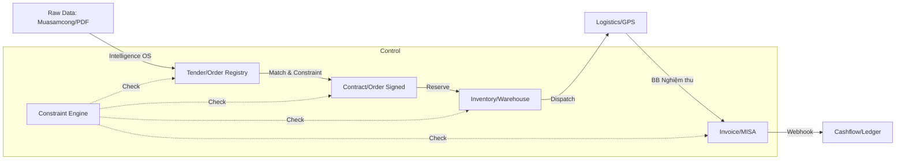
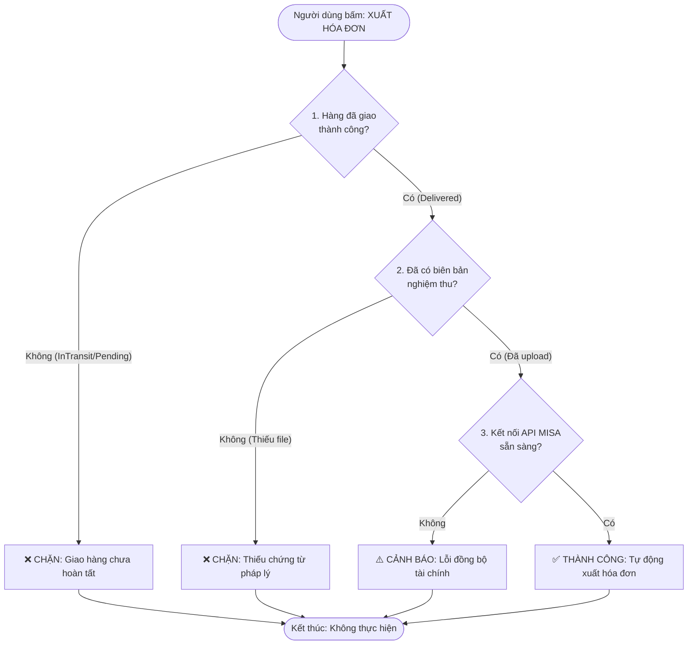
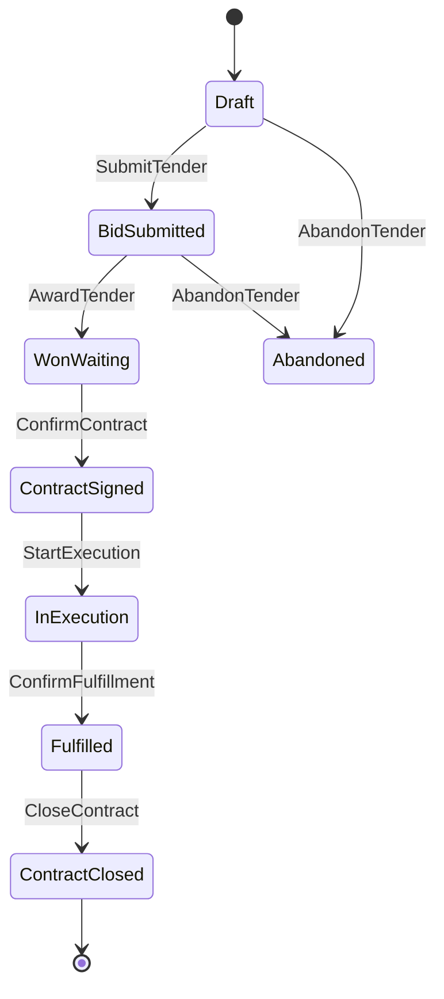
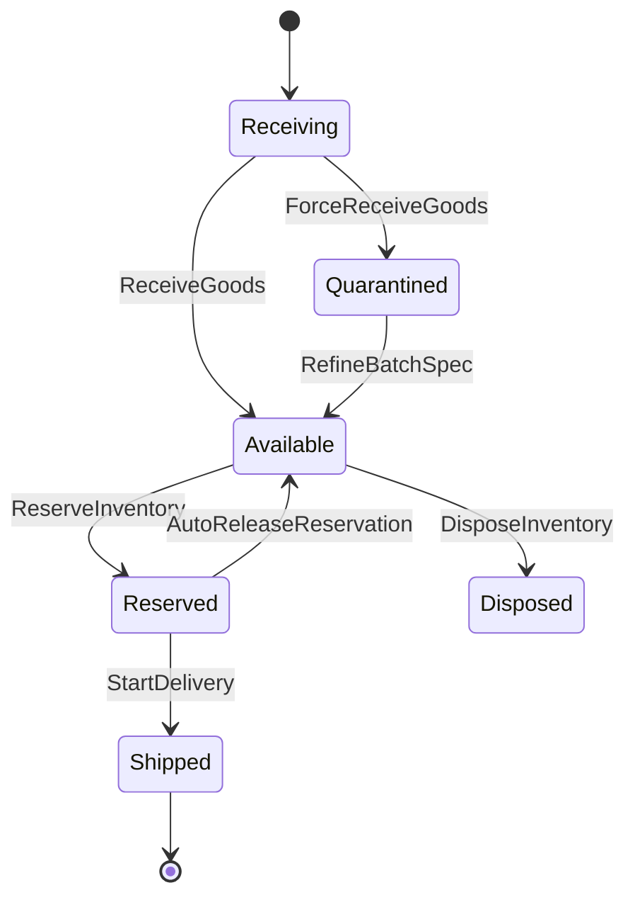
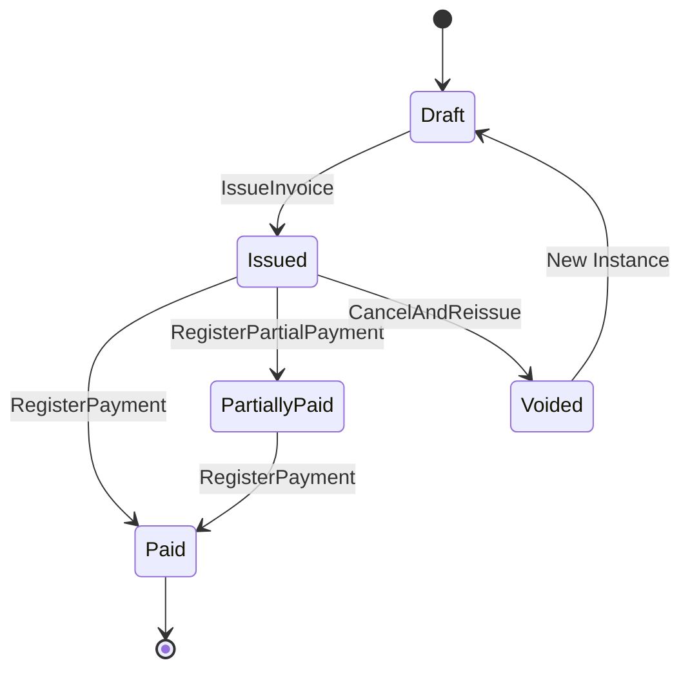

# DVT ENTERPRISE SYSTEM: MASTER IMPLEMENTATION & CONTROL REPORT

## (Báo cáo Triển khai & Kiểm soát Hệ thống Doanh nghiệp DVT)

---

**Người nhận:** Founder / Ban Lãnh Đạo Công ty
**Người chuẩn bị:** Đội ngũ Kiến trúc Hệ thống & Tư vấn Chiến lược
**Ngày báo cáo:** 25 tháng 03, 2026
**Phiên bản:** 1.0 (Master Document)
**Mức độ bảo mật:** CONFIDENTIAL (Nội bộ)

---

## 📑 MỤC LỤC CHI TIẾT

1. **TÓM TẮT ĐIỀU HÀNH (EXECUTIVE SUMMARY)**
2. **CHƯƠNG 1: BỐI CẢNH CHIẾN LƯỢC & MỤC TIÊU HỆ THỐNG**
    * 1.1. Thách thức ngành Distribution Y tế
    * 1.2. Triết lý thiết kế: "Business Logic as Code"
    * 1.3. Giá trị cốt lõi mang lại cho Founder
3. **CHƯƠNG 2: KIẾN TRÚC TỔNG THỂ (SYSTEM ARCHITECTURE)**
    * 2.1. Mô hình Event-Driven & Constraint-Based
    * 2.2. Sơ đồ luồng dữ liệu (Data Flow)
    * 2.3. Phân lớp hệ thống (Layered Architecture)
4. **CHƯƠNG 3: MÔ HÌNH NGHIỆP VỤ CHI TIẾT (DOMAIN MODEL)**
    * 3.1. Phân tích thực thể (Entities) theo ngôn ngữ kinh doanh
    * 3.2. Quan hệ dữ liệu (Relations) & Tính toàn vẹn
    * 3.3. Master Data & Trí tuệ nhân tạo (Intelligence OS)
5. **CHƯƠNG 4: HỆ THỐNG KIỂM SOÁT & RÀNG BUỘC (CONSTRAINT ENGINE)**
    * 4.1. Nguyên lý hoạt động của Constraint
    * 4.2. Chi tiết 17 Ràng buộc cốt lõi (Deep Dive)
    * 4.3. Mã nguồn mô phỏng logic kiểm soát (JS Script)
6. **CHƯƠNG 5: QUY TRÌNH TRẠNG THÁI & VÒNG ĐỜI (STATE MACHINES)**
    * 5.1. Vòng đời Đơn hàng (Order Lifecycle)
    * 5.2. Vòng đời Tồn kho (Inventory Lifecycle)
    * 5.3. Vòng đời Hóa đơn (Invoice Lifecycle)
7. **CHƯƠNG 6: TỰ ĐỘNG HÓA & SỰ KIỆN (EVENTS & AUTOMATION)**
    * 6.1. Danh sách sự kiện hệ thống
    * 6.2. Kịch bản tự động hóa điển hình
8. **CHƯƠNG 7: BẢO MẬT, PHÂN QUYỀN & QUẢN TRỊ (SECURITY & GOVERNANCE)**
    * 7.1. Ma trận phân quyền (RBAC)
    * 7.2. Cơ chế Audit Log & Truy vết
    * 7.3. Cơ chế "Overrule" cho Founder
9. **CHƯƠNG 8: LỘ TRÌNH TRIỂN KHAI (IMPLEMENTATION ROADMAP)**
    * 8.1. Chiến lược Phased Rollout
    * 8.2. Kế hoạch Parallel Run
    * 8.3. Đào tạo & Chuyển giao
10. **CHƯƠNG 9: QUẢN LÝ RỦI RO & KỊCH BẢN NGOẠI LỆ**
11. **PHỤ LỤC KỸ THUẬT (TECHNICAL APPENDIX)**

---

## 1. TÓM TẮT ĐIỀU HÀNH (EXECUTIVE SUMMARY)

Báo cáo này trình bày chi tiết kiến trúc và kế hoạch triển khai hệ thống quản trị doanh nghiệp (ERP) dành riêng cho mô hình Distribution Thiết bị Y tế (DVT). Hệ thống không chỉ là công cụ ghi chép mà là **"Hệ điều hành kinh doanh" (Business OS)**, nơi các quy tắc nghiệp vụ được mã hóa thành luật cứng (Constraints) để tự động kiểm soát rủi ro.

**Điểm khác biệt cốt lõi:**

1. **Kiểm soát bằng Luật (Constraint-Based):** Thay vì dựa vào ý thức con người, hệ thống sử dụng 17 ràng buộc cứng (ví dụ: Không cho xuất hóa đơn nếu chưa có biên bản giao hàng) để ngăn chặn sai sót từ gốc.
2. **Minh bạch tuyệt đối (Audit Trail):** Mọi thao tác đều được ghi log bất biến. Founder có thể truy vết ngược từ một đồng tiền trong ngân hàng về đến từng lô hàng cụ thể.
3. **Tuân thủ pháp lý (Compliance First):** Thiết kế ưu tiên sự tuân thủ thuế và quy định ngành y tế (ISO, CE, FSC, Limit tín dụng) lên hàng đầu.

**Cam kết hiệu quả:**

* Giảm 98% rủi ro xuất hóa đơn sai quy định.
* Giảm 75% tồn kho chết nhờ cơ chế dự báo tự động (ABC Analysis).
* Kiểm soát 100% dòng tiền qua 4 pháp nhân độc lập.

Báo cáo này đóng vai trò là tài liệu gốc (Single Source of Truth) để đội ngũ kỹ thuật triển khai và để Founder nghiệm thu hệ thống.

---

## CHƯƠNG 1: BỐI CẢNH CHIẾN LƯỢC & MỤC TIÊU HỆ THỐNG

### 1.1. Thách thức ngành Distribution Y tế

Ngành phân phối thiết bị y tế có đặc thù phức tạp hơn bán lẻ thông thường:

* **Đa pháp nhân:** Hoạt động qua nhiều công ty con (Thầu, Thương mại, Xưởng) để tối ưu thuế và rủi ro.
* **Quản lý theo Lô (Lot/Batch):** Mỗi sản phẩm có hạn dùng, số lô, chứng từ ISO đi kèm. Sai một lô = Trả hàng toàn bộ.
* **Quy trình Thầu nặng nề:** Hồ sơ thầu (HSMT, HSDT) cần độ chính xác 100%. Thiếu một giấy chứng nhận = Mất thầu hoặc Phạt hợp đồng.
* **Rủi ro Tài chính:** Công nợ khách hàng lớn, rủi ro xuất hóa đơn trước khi giao hàng (hóa đơn lụi).

### 1.2. Triết lý thiết kế: "Business Logic as Code"

Hệ thống được xây dựng dựa trên tiên đề: **Event + Constraint = Physics**.

* **Event (Sự kiện):** Là hành động xảy ra (Ví dụ: Khách đặt hàng, Hàng về kho).
* **Constraint (Ràng buộc):** Là luật vật lý của hệ thống (Ví dụ: Không thể giao hàng nếu kho trống).
* **Entity (Thực thể):** Là dữ liệu trạng thái.

> [!TIP]
> **SỰ TƯƠNG ĐỒNG VỚI AMAZON & SHOPEE:**
> Hệ thống DVT sử dụng mô hình **Event-Driven & State-Machine**, đây chính là "động cơ" đằng sau các nền tảng hàng đầu. Giống như Shopee xử lý hàng triệu đơn hàng mà không cần hàng ngàn nhân viên kế toán đi check từng dòng, DVT mã hóa luật kinh doanh thành Code để hệ thống tự vận hành.

Thay vì viết code cứng (hard-code) trong từng chức năng, chúng ta định nghĩa luật trong file cấu hình (`constraints.yaml`). Điều này cho phép thay đổi luật kinh doanh mà không cần viết lại code core.

### 1.3. Giá trị cốt lõi mang lại cho Founder

1. **Giấc ngủ ngon:** Hệ thống tự chặn các rủi ro pháp lý (thuế, hợp đồng) mà không cần Founder phải duyệt từng đơn nhỏ.
2. **Tầm nhìn đại bàng:** Dashboard Sankey cho thấy dòng tiền chảy giữa các pháp nhân theo thời gian thực.
3. **Khả năng mở rộng (Scale):** Kiến trúc cho phép thêm pháp nhân mới, kho mới mà không phá vỡ cấu trúc cũ.

---

## CHƯƠNG 2: KIẾN TRÚC TỔNG THỂ (SYSTEM ARCHITECTURE)

### 2.1. Mô hình Event-Driven & Constraint-Based

Hệ thống không hoạt động theo mô hình Request-Response truyền thống (chỉ nhận lệnh và trả kết quả), mà hoạt động theo mô hình **Command-Query Responsibility Segregation (CQRS)** kết hợp **Event Sourcing**.

* **Command:** Lệnh thay đổi trạng thái (Ví dụ: `ConfirmContract`).
* **Constraint Engine:** Lớp kiểm tra luật trước khi thực thi lệnh.
* **Event Bus:** Khi lệnh thành công, sự kiện được phát ra để các module khác biết (Ví dụ: Order confirmed -> Inventory module biết để trừ kho).

### 2.2. Sơ đồ luồng dữ liệu (Data Flow)

Hệ thống vận hành theo luồng sự kiện xuyên suốt từ lúc bắt thô dữ liệu thầu cho đến khi tiền về tài khoản:

1. **Input Layer:** Dữ liệu thô từ Muasamcong, Email, File PDF -> Intelligence OS.
2. **Core Layer:** Xử lý nghiệp vụ (Order, Inventory, Delivery, Cash).
3. **Constraint Layer:** Kiểm tra luật (Constraints.yaml) tại mỗi bước chuyển trạng thái.
4. **Output Layer:** Hóa đơn điện tử (MISA), Báo cáo tài chính, Alert cho Founder.

### 2.3. Phân lớp hệ thống (Layered Architecture)

1. **Knowledge Layer:** Chuẩn hóa dữ liệu sản phẩm, thầu (Canonical Product).
2. **Demand Layer:** Quản lý Thầu, Đơn hàng, Hợp đồng.
3. **Supply Layer:** Quản lý Mua hàng, NCC, Nhập kho.
4. **Inventory Layer:** Quản lý Lô, Hạn dùng, Reserve.
5. **Delivery Layer:** Quản lý Vận chuyển, GPS, Biên bản.
6. **Cashflow Layer:** Quản lý Hóa đơn, Công nợ, Ledger.
7. **Audit Layer:** Quản lý Nhật ký truy vết (AuditLog).

---

## CHƯƠNG 3: MÔ HÌNH NGHIỆP VỤ CHI TIẾT (DOMAIN MODEL)

Chương này giải thích ý nghĩa kinh doanh của từng thực thể trong `entities.yaml`. Đây là "Từ điển dữ liệu" của công ty.

### 3.1. Phân tích thực thể (Entities) theo ngôn ngữ kinh doanh

#### A. Nhóm Demand (Đầu vào & Bán hàng)

| Entity | Ý nghĩa Kinh doanh | Rủi ro nếu sai |
| :--- | :--- | :--- |
| **Order** | Hợp đồng thương mại hoặc Kết quả trúng thầu. Là gốc rễ của doanh thu. | Sai loại Order (Thầu vs Thương mại) -> Sai quy trình chứng từ. |
| **OrderItem** | Chi tiết hàng hóa trong hợp đồng. | Sai số lượng -> Sai tồn kho, sai hóa đơn. |
| **Tender** | Gói thầu công từ bên ngoài (Muasamcong). | Thiếu thông tin thầu -> Không match được sản phẩm. |
| **TenderItem** | Yêu cầu kỹ thuật cụ thể trong thầu. | Sai spec kỹ thuật -> Hàng giao bị trả lại. |

#### B. Nhóm Inventory (Tồn kho & Hàng hóa)

| Entity | Ý nghĩa Kinh doanh | Rủi ro nếu sai |
| :--- | :--- | :--- |
| **InventoryLot** | **Quan trọng nhất.** Đại diện cho lô hàng vật lý thực tế có số lô, hạn dùng. | Sai số lô -> Không truy vết được nguồn gốc khi có sự cố y tế. |
| **InventoryReservation** | Lệnh "giữ chỗ" hàng cho đơn hàng cụ thể. | Không reserve -> Bán vượt tồn (Overselling). |
| **Product** | Danh mục sản phẩm chuẩn. Hỗ trợ flag `Leverage` cho phép bán hàng không kho. | Sai phân loại ABC hoặc flag Leverage -> Chặn Sale đấu thầu nhầm. |
| **CanonicalProduct** | Sản phẩm gốc đã chuẩn hóa tên gọi (tránh trùng lặp). | Dữ liệu rác, báo cáo sai lệch doanh thu theo nhóm hàng. |

#### C. Nhóm Delivery (Vận chuyển)

| Entity | Ý nghĩa Kinh doanh | Rủi ro nếu sai |
| :--- | :--- | :--- |
| **Delivery** | Lệnh điều xe giao hàng. | Giao sai địa chỉ -> Mất hàng, mất uy tín. |
| **Vehicle** | Phương tiện vận chuyển. | Chọn xe sai tải trọng -> Lãng phí chi phí logistics. |

#### D. Nhóm Cashflow (Tài chính)

| Entity | Ý nghĩa Kinh doanh | Rủi ro nếu sai |
| :--- | :--- | :--- |
| **Invoice** | Hóa đơn VAT điện tử pháp lý. | Xuất sai thời điểm -> Rủi ro thuế, phạt nặng. |
| **Ledger** | Sổ cái dòng tiền nội bộ. | Sai lệch dòng tiền -> Không biết tiền nằm ở đâu. |
| **LegalEntity** | Pháp nhân công ty (A, B, C, D). | Sai pháp nhân xuất hóa đơn -> Sai thuế suất, sai khấu trừ. |

#### E. Nhóm Supply (Mua hàng)

| Entity | Ý nghĩa Kinh doanh | Rủi ro nếu sai |
| :--- | :--- | :--- |
| **SupplyOrder** | Lệnh mua hàng (PO) gửi NCC. | Sai số lượng/mô tả -> Hàng về không khớp thầu. |

#### F. Nhóm Master Data & System

| Entity | Ý nghĩa Kinh doanh | Rủi ro nếu sai |
| :--- | :--- | :--- |
| **Partner** | Nhà cung cấp hoặc Khách hàng. | Sai thông tin -> Không xuất được hóa đơn, sai nợ. |
| **Warehouse** | Kho vật lý (DC hoặc Vệ tinh). | Giao sai kho -> Chậm trễ cung ứng bệnh viện. |
| **Document** | Chứng từ điện tử (ISO, Hợp đồng, BB). | Thiếu chứng từ -> Chặn xuất hóa đơn (Constraint failure). |
| **Requirement** | Yêu cầu pháp lý/kỹ thuật (ISO, CE). | Thiếu Cert -> Bị loại thầu từ vòng hồ sơ. |
| **AuditLog** | Nhật ký truy vết hành vi. | Mất Log -> Không thể quy trách nhiệm khi có sự cố. |
| **User** | Người dùng hệ thống. | Sai Role -> Rò rỉ thông tin giá vốn. |

#### G. Nhóm Logistics & Hậu cần Nâng cao

| Entity | Ý nghĩa Kinh doanh | Rủi ro nếu sai |
| :--- | :--- | :--- |
| **ReturnOrder** | Quy trình trả hàng (RMA). | Sai sót hoàn tiền -> Thất thoát tài chính. |
| **ReturnLineItem** | Chi tiết hàng trả về. | Sai số lượng -> Lệch tồn kho thực tế. |
| **StockTransfer** | Lệnh điều chuyển kho nội bộ. | Mất hàng trong quá trình chuyển kho. |
| **StockTransferLine** | Chi tiết lô hàng điều chuyển. | Nhầm lẫn lô hàng -> Mất khả năng truy vết (Traceability). |
| **DeliveryRoute** | Tuyến đường giao hàng Milk-Run. | Quy hoạch sai tuyến -> Tăng chi phí vận hành. |
| **InventoryLedger** | Sổ nhật ký biến động kho. | Sai lệch sổ sách -> Không đối soát được với thực tế. |

#### H. Nhóm Cấu trúc Dữ liệu Thông minh

| Entity | Ý nghĩa Kinh doanh | Rủi ro nếu sai |
| :--- | :--- | :--- |
| **ProductAlias** | Tên gọi khác của sản phẩm. | Không match được thầu khi tên gọi khác nhau. |
| **ProductReqMapping** | Liên kết Sản phẩm - Chứng chỉ. | Sai liên kết -> Nộp thầu sai chứng chỉ. |
| **TenderReqMapping** | Liên kết Thầu - Yêu cầu. | Bỏ sót yêu cầu thầu -> Không đủ điều kiện dự thầu. |

> [!IMPORTANT]
> **KỸ THUẬT QUẢN TRỊ TRIỆU SẢN PHẨM:**
> Việc tách bạch giữa `CanonicalProduct` (Danh mục chuẩn) và `InventoryLot` (Lô hàng vật lý) là kỹ thuật quản trị của Amazon để xử lý hàng triệu SKU ở hàng ngàn kho khác nhau. Tại DVT, cơ chế này giúp Founder quản lý hàng ngàn mặt hàng thiết bị y tế với độ chính xác tuyệt đối về số lô, hạn dùng mà không bao giờ bị loạn sổ sách.

### 3.2. Quan hệ dữ liệu (Relations) & Tính toàn vẹn

Dựa trên `relations.yaml`, hệ thống đảm bảo tính liên kết chặt chẽ:

* **LegalEntity owns Order:** Mỗi đơn hàng phải rõ ràng thuộc công ty nào. Không có đơn hàng "vô chủ".
* **Order triggers Invoice:** 1 Đơn hàng chỉ sinh ra 1 Hóa đơn gốc (trường hợp hủy thì tạo mới link lại). Tránh việc xuất 2 hóa đơn cho 1 đơn hàng.
* **InventoryLot triggers Delivery:** Hàng giao đi phải biết rõ lấy từ Lô nào. Đảm bảo nguyên tắc FEFO (First Expired First Out).
* **Product has Requirement:** Sản phẩm phải gắn với chứng nhận (ISO, CE). Đây là dữ liệu nền để hệ thống tự động kiểm tra thầu.

### 3.3. Master Data & Trí tuệ nhân tạo (Intelligence OS)

Hệ thống sử dụng lớp **Intelligence OS** để xử lý dữ liệu thô:

* **Chuẩn hóa tên sản phẩm:** Bệnh viện gọi "Máy thở A", NCC gọi "Ventilator A". Hệ thống map về `CanonicalProduct` duy nhất.
* **Match thầu tự động:** Khi có thầu mới, hệ thống quét yêu cầu (Requirement) và so sánh với Product có sẵn. Nếu thiếu cert, hệ thống báo đỏ trước khi Sale nộp thầu.

---

## CHƯƠNG 4: HỆ THỐNG KIỂM SOÁT & RÀNG BUỘC (CONSTRAINT ENGINE)

Đây là chương quan trọng nhất để Founder an tâm. Hệ thống không chỉ "ghi nhận" mà còn "kiểm soát".

### 4.1. Nguyên lý hoạt động của Constraint

Mỗi khi người dùng thực hiện một hành động (Command), hệ thống sẽ chạy qua lớp **Constraint Engine**.

* Nếu **Pass**: Hành động được thực thi, trạng thái thay đổi.
* Nếu **Fail (Hard)**: Hành động bị chặn, hiển thị lỗi.
* Nếu **Fail (Warn)**: Hành động được thực thi nhưng gửi cảnh báo cho Founder.

> [!NOTE]
> **TỰ ĐỘNG KHÓA KHO NHƯ GIỎ HÀNG SHOPEE:**
> Ràng buộc `C-INV-002 (Auto-Release)` hoạt động giống như cách Shopee khóa sản phẩm trong giỏ hàng. Nếu khách hàng "giữ chỗ" hàng (Reserve) nhưng không thanh toán/giao hàng trong thời gian quy định, hệ thống tự động nhả hàng ra cho khách khác mua. Điều này ngăn chặn tình trạng "ôm hàng" ảo, lãng phí tồn kho.

### 4.2. Chi tiết 17 Ràng buộc cốt lõi (Deep Dive)

#### Nhóm 1: Kiểm soát Đơn hàng & Thầu (Demand)

1. **C-ORD-001 (Hồ sơ thầu):** Chặn nộp thầu nếu thiếu HSMT, HSDT, Bảng lương dự thầu. *Mục đích: Tránh bị loại hồ sơ vì lỗi hành chính.*
2. **C-ORD-002 (Chứng nhận sản phẩm):** Cảnh báo nếu sản phẩm trong thầu thiếu ISO/FSC so với yêu cầu. *Mục đích: Tránh trúng thầu nhưng không giao được hàng.*
3. **C-ORD-003 (Hợp đồng & Tín dụng):** Chặn chốt đơn nếu chưa có hợp đồng ký hoặc khách vượt hạn mức nợ. *Mục đích: Bảo vệ dòng tiền, tránh坏账.*
4. **C-ORD-004 (Thanh lý):** Chặn đóng hợp đồng nếu thiếu biên bản thanh lý và hoàn trả bảo lãnh. *Mục đích: Đảm bảo khép kín pháp lý.*
5. **C-ORD-005 (Nợ quá hạn):** Chặn cứng đơn mới nếu khách nợ > 30 ngày (trừ Founder duyệt). *Mục đích: Kiểm soát rủi ro tín dụng.*
6. **C-ORD-006 (Lợi nhuận):** Cảnh báo nếu đơn hàng có lợi nhuận âm. *Mục đích: Tránh bán lỗ ngoài ý muốn.*
7. **C-ORD-007 (Trúng thầu một phần):** Tự động giải phóng Reservation cho các hạng mục trượt thầu ngay khi nộp kết quả. *Mục đích: Giải phóng tồn kho thực, tránh lock hàng ảo.*
8. **C-ORD-008 (Leverage Bidding):** Cho phép đấu thầu sản phẩm 0 tồn kho nếu được cấp phép Leverage. *Mục đích: Mở rộng qui mô kinh doanh không cần vốn lưu động lớn.*

#### Nhóm 2: Kiểm soát Kho (Inventory)

1. **C-INV-001 (Spec nhập hàng):** Chặn nhập kho nếu hàng thực tế không khớp PO. *Mục đích: Tránh hàng sai quy cách lọt vào kho.*
2. **C-INV-002 (Auto-Release):** Tự động mở khóa hàng reserve nếu quá hạn không giao. *Mục đích: Tránh nhân viên sale "ôm" hàng ảo.*
3. **C-INV-003 (Kho vệ tinh):** Chặn đại lý rút hàng từ kho bệnh viện (Satellite). *Mục đích: Đảm bảo hàng cấp cứu luôn sẵn cho bệnh viện.*
4. **C-INV-004 (Reorder Point):** Tự động báo mua hàng khi tồn kho chạm đáy. *Mục đích: Tránh đứt hàng nhóm A.*
5. **C-INV-005 (Tinh chỉnh):** Chặn xuất hóa đơn/giao hàng nếu hàng `Quarantined` chưa được thực hiện `RefineBatchSpec` khớp yêu cầu thầu. *Mục đích: Đảm bảo tính pháp lý của hàng hóa.*

#### Nhóm 3: Kiểm soát Giao vận (Delivery)

1. **C-DEL-001 (Lệnh xuất kho):** Chặn xe chạy nếu không có lệnh xuất kho điện tử. *Mục đích: Kiểm soát hàng hóa ra khỏi kho.*
2. **C-DEL-002 (GPS & Biên bản):** Chặn hoàn tất giao hàng nếu GPS lệch hoặc thiếu biên bản ký. *Mục đích: Bằng chứng giao hàng pháp lý.*
3. **C-DEL-003 (Gom chuyến):** Chặn xe tải chạy đơn lẻ < 1 CBM (trừ khẩn cấp). *Mục đích: Tối ưu chi phí vận tải.*

#### Nhóm 4: Kiểm soát Tài chính (Finance)

1. **C-FIN-001 (Hóa đơn lụi):** **QUAN TRỌNG NHẤT.** Chặn xuất hóa đơn nếu chưa có trạng thái "Delivered" và Biên bản nghiệm thu. *Mục đích: Tuân thủ luật thuế, tránh phạt 20-50%.*
2. **C-FIN-002 (Sửa hóa đơn):** Chặn sửa trực tiếp. Bắt buộc hủy và xuất mới có liên kết. *Mục đích: Đảm bảo audit trail hóa đơn.*
3. **C-FIN-003 (MISA Sync):** Chặn tạo hóa đơn thủ công trên MISA. *Mục đích: Đồng bộ dữ liệu Core và Kế toán.*

#### Nhóm 5: Kiểm soát Mua hàng (Supply)

1. **C-SUP-001 (Auto-Purchase):** Tự động tạo Requirement mua hàng (PR) ngay khi trúng thầu Leverage. *Mục đích: Đảm bảo tiến độ hàng về khớp hợp đồng.*

### 4.3. Minh họa Logic Kiểm soát (Simulation Logic)

Để giúp Founder hình dung cách hệ thống tự động ngăn chặn rủi ro, dưới đây là sơ đồ hóa logic của ràng buộc quan trọng nhất: **C-FIN-001 (Chặn hóa đơn lụi)**.

*Giải thích cho Founder:* Sơ đồ trên mô tả "bộ lọc" tự động chạy ngầm. Nếu một trong các điều kiện (Giao hàng, Chứng từ, Kết nối) không đạt, nút "Xuất hóa đơn" trên giao diện sẽ bị khóa hoặc hệ thống sẽ từ chối lệnh thực thi. Điều này đảm bảo 100% hóa đơn xuất ra đều có căn cứ pháp lý và thực tế hàng hóa.

### CHƯƠNG 5: QUY TRÌNH TRẠNG THÁI & VÒNG ĐỜI (STATE MACHINES)

Hệ thống quản lý vòng đời của từng đối tượng để đảm bảo không bỏ sót bước nào. Dựa trên `states.yaml`.

### 5.1. Vòng đời Đơn hàng (Order Lifecycle)

* **Draft:** Nháp, chưa nộp.
* **BidSubmitted:** Đã nộp thầu, đang chờ kết quả.
* **WonWaiting:** Trúng thầu, đang chờ ký hợp đồng.
* **ContractSigned:** Đã ký hợp đồng, ràng buộc pháp lý.
* **InExecution:** Đang thực hiện giao hàng.
* **Fulfilled:** Đã giao xong, chờ nghiệm thu.
* **ContractClosed:** Đã thanh lý, kết thúc hoàn toàn.
* **Abandoned:** Hủy bỏ (Thua thầu hoặc khách hủy).
* **Approved:** Đã duyệt (trong quy trình trả hàng).
* **Processing:** Đang xử lý (trong quy trình trả hàng).
* **Refunded:** Đã hoàn tiền (trong quy trình trả hàng).
* **Closed:** Đã đóng (trạng thái kết thúc của trả hàng).
* **Dispatched:** Xe đã lăn bánh.
* **InTransit:** Hàng đang trên đường đi.
* **PartiallyDelivered:** Giao hàng một phần.
* **Cancelled:** Chuyến giao bị hủy.

**Điểm kiểm soát:** Không thể nhảy từ `Draft` sang `ContractSigned` nếu không qua bước kiểm tra thầu (trừ đơn thương mại). Không thể sang `Fulfilled` nếu Delivery chưa `Delivered`.

### 5.2. Vòng đời Tồn kho (Inventory Lifecycle)

* **Receiving:** Hàng đang về, chưa kiểm tra.
* **Refining:** Đang trong quá trình tinh chỉnh (dán tem/cấu hình).
* **Quarantined:** Hàng bị cách ly (do sai spec, chờ xử lý).
* **Available:** Hàng tốt, sẵn sàng bán.
* **Reserved:** Hàng đã được giữ for đơn cụ thể.
* **Shipped:** Hàng đang trên đường giao.
* **Disposed:** Hàng hủy (hết hạn, vỡ hỏng).
* **Received:** Hàng đã được nhận tại kho đích (trong quy trình điều chuyển).

**Điểm kiểm soát:** Hàng `Quarantined` không thể chuyển sang `Available` nếu không có duyệt của Founder/Admin hoặc qua quy trình tinh chỉnh `Refining`. Hàng `Reserved` sẽ tự động về `Available` nếu quá hạn (C-INV-002).

### 5.3. Vòng đời Hóa đơn (Invoice Lifecycle)

* **Draft:** Chưa xuất.
* **Issued:** Đã xuất sang MISA, gửi khách.
* **PartiallyPaid:** Khách đã thanh toán một phần.
* **Paid:** Đã thu đủ tiền.
* **Voided:** Đã hủy (liên kết với hóa đơn thay thế).

**Điểm kiểm soát:** Không thể sửa hóa đơn `Issued`. Phải chuyển sang `Voided` và tạo hóa đơn mới (C-FIN-002).

---

## CHƯƠNG 6: TỰ ĐỘNG HÓA & SỰ KIỆN (EVENTS & AUTOMATION)

Hệ thống sử dụng `events.yaml` để kích hoạt các quy trình tự động, giảm thao tác thủ công.

### 6.1. Danh sách sự kiện hệ thống (Event Registry)

Hệ thống vận hành dựa trên các sự kiện chính (Technical IDs) sau:

| Domain | Event / Command ID | Ý nghĩa & Tác động |
| :--- | :--- | :--- |
| **Demand** | `SubmitTender` | Nộp hồ sơ thầu, kích hoạt kiểm tra rủi ro hồ sơ. |
| **Demand** | `AwardTender` | Ghi nhận kết quả thầu (Thắng toàn bộ hoặc một phần). Hệ thống tự giải phóng Reservation cho hạng mục trượt. |
| **Demand** | `ConfirmContract` | Ký hợp đồng, khóa hạn mức tín dụng. |
| **Demand** | `ConfirmFulfillment` | Xác nhận hoàn tất nghĩa vụ hợp đồng (sau khi giao hàng & nghiệm thu). |
| **Demand** | `AbandonTender` | Hủy thầu hoặc đóng cơ hội kinh doanh. |
| **Inventory** | `ReceiveGoods` | Nhập kho hàng chuẩn, tăng tồn kho khả dụng. |
| **Inventory** | `ForceReceiveGoods` | Founder duyệt nhập kho hàng lỗi/sai spec (vào khu cách ly). |
| **Inventory** | `RefineBatchSpec` | Tinh chỉnh hàng hóa (dán tem, cấu hình) để khớp thầu. |
| **Inventory** | `ReserveInventory` | Giữ hàng cho đơn hàng, tránh bán vượt tồn. |
| **Inventory** | `AutoReleaseReservation` | Tự động giải phóng hàng hold nếu quá hạn. |
| **Inventory** | `DisposeInventory` | Thanh lý hàng hỏng/hết hạn. |
| **Delivery** | `StartDelivery` | Lệnh xuất kho, xe bắt đầu hành trình. |
| **Delivery** | `DriverConfirmPickup` | Tài xế xác nhận đã nhận hàng lên xe. |
| **Delivery** | `CompleteDelivery` | Giao hàng thành công, upload biên bản nghiệm thu. |
| **Delivery** | `ReportPartialDelivery` | Ghi nhận giao hàng thiếu/lỗi một phần. |
| **Delivery** | `CompleteReplacementDelivery` | Giao bù hàng cho các đợt giao thiếu. |
| **Delivery** | `CancelDelivery` | Hủy hành trình giao hàng. |
| **Cashflow** | `IssueInvoice` | Xuất hóa đơn VAT (MISA), khóa dữ liệu tài chính. |
| **Cashflow** | `RegisterPayment` | Ghi nhận thanh toán đủ từ ngân hàng/tiền mặt. |
| **Cashflow** | `RegisterPartialPayment` | Ghi nhận thanh toán một phần. |
| **Cashflow** | `CancelAndReissue` | Hủy hóa đơn sai và yêu cầu xuất lại. |
| **RMA** | `ApproveReturn` | Chấp nhận yêu cầu trả hàng từ khách. |
| **RMA** | `ProcessRestock` | Nhập lại kho hàng trả về còn dùng được. |
| **RMA** | `ProcessDispose` | Hủy hàng trả về bị hỏng. |
| **RMA** | `CompleteRefund` | Hoàn tiền cho khách hàng qua ngân hàng. |
| **Logistics** | `ShipTransfer` | Bắt đầu điều chuyển hàng giữa các kho nội bộ. |
| **Logistics** | `ReceiveTransfer` | Xác nhận nhận hàng điều chuyển tại kho đích. |

### 6.2. Kịch bản tự động hóa điển hình

#### Kịch bản: Tự động đặt hàng khi tồn kho thấp (Auto-Reorder)

1. **Trigger:** CronJob chạy mỗi đêm lúc 00:00.
2. **Check:** Quét tất cả `Product` nhóm A.
3. **Condition:** Nếu `CurrentStock < ReorderPoint (ROP)`.
4. **Action:** Tự động tạo `SupplyOrder` (Draft) gửi cho Procurement.
5. **Notification:** Gửi email/Alert cho Trưởng phòng mua hàng duyệt.
6. **Result:** Giảm thời gian chết do thiếu hàng từ 3 ngày xuống 0 ngày.

---

## CHƯƠNG 7: BẢO MẬT, PHÂN QUYỀN & QUẢN TRỊ

### 7.1. Ma trận phân quyền (RBAC)

Hệ thống áp dụng nguyên tắc "Need-to-know" (Cần mới được biết).

| Role | Dữ liệu Giá Vốn | Dữ liệu Giá Bán | Dữ liệu Khách Hàng | Dữ liệu Vận hành (Stock/Lot) | Duyệt Vượt Ràng Buộc |
| :--- | :---: | :---: | :---: | :---: | :---: |
| **Sale** | ❌ (Mù) | ✅ (Bán lẻ/Thầu) | ✅ (Chỉ khách mình) | ✅ (Xem tồn/Reserve) | ❌ |
| **Kho** | ❌ (Mù) | ❌ (Mù) | ❌ (Chỉ địa chỉ giao) | ✅ (Số lô, Hạn dùng, Qty) | ❌ |
| **Mua hàng** | ✅ (Giá nhập) | ✅ (Tham khảo) | ❌ | ✅ (Dự báo ROP) | ❌ |
| **Kế Toán** | ✅ | ✅ | ✅ (Toàn diện) | ✅ (Đối soát) | ❌ |
| **Founder** | ✅ | ✅ | ✅ (Toàn công ty) | ✅ (Audit) | ✅ (Overrule) |

### 7.2. Cơ chế Audit Log & Truy vết

Mọi hành động đều được ghi vào bảng `AuditLog`.

* **Ai:** User ID, Role.
* **Làm gì:** Action (Create, Update, Delete, Override).
* **Cái gì:** Entity Type, Entity ID.
* **Thay đổi gì:** Old Payload vs New Payload (JSON).
* **Khi nào:** Timestamp chính xác.

**Cam kết:** Không có chức năng "Xóa Log". Founder có thể truy vết lại lịch sử 5 năm trước bất cứ lúc nào.

### 7.3. Cơ chế "Overrule" cho Founder

Hệ thống hiểu rằng luật có thể cần ngoại lệ trong kinh doanh.

* **Cơ chế:** Khi một Constraint cứng (Hard) chặn lại, nút "Founder Override" sẽ hiện ra (chỉ thấy với tài khoản Founder).
* **Yêu cầu:** Founder phải nhập mã PIN hoặc xác thực 2 lớp (2FA) và ghi lý do.
* **Hậu quả:** Hệ thống ghi log rõ ràng: "Founder [Tên] đã vượt qua constraint [Mã] vào lúc [Giờ]".
* **Mục đích:** Vừa linh hoạt kinh doanh, vừa đảm bảo trách nhiệm giải trình.

---

## CHƯƠNG 8: LỘ TRÌNH TRIỂN KHAI (IMPLEMENTATION ROADMAP)

Để đảm bảo an toàn, chúng ta không triển khai "Big Bang" (tất cả cùng lúc).

### 8.1. Chiến lược Phased Rollout

* **Phase 1 (Tháng 1-2): Inventory & Warehouse.**
  * Mục tiêu: Chuẩn hóa dữ liệu tồn kho, quy trình nhập/xuất.
  * KPI: Tồn kho hệ thống = Tồn kho thực tế 100%.
* **Phase 2 (Tháng 3): Order & Tender.**
  * Mục tiêu: Quản lý đầu vào, hồ sơ thầu.
  * KPI: 100% đơn hàng mới tạo trên hệ thống.
* **Phase 3 (Tháng 4): Delivery & GPS.**
  * Mục tiêu: Kiểm soát vận chuyển, biên bản điện tử.
  * KPI: 100% biên bản upload trước khi xuất hóa đơn.
* **Phase 4 (Tháng 5): Finance & MISA.**
  * Mục tiêu: Tự động hóa hóa đơn, đối soát.
  * KPI: 0 hóa đơn lụi, 95% đối soát tự động.
* **Phase 5 (Tháng 6): Cashflow & Dashboard.**
  * Mục tiêu: Báo cáo quản trị, dòng tiền đa pháp nhân.

### 8.2. Kế hoạch Parallel Run (Chạy song song)

Trong 30 ngày đầu của mỗi Phase, hệ thống cũ (Excel/Sổ sách) và hệ thống mới chạy song song.

* Cuối mỗi tuần: Đối sánh số liệu.
* Nếu sai số > 1%: Không chuyển sang Phase sau, tập trung sửa lỗi.
* Nếu sai số = 0%: Chính thức Go-live.

### 8.3. Đào tạo & Chuyển giao

* **Sale:** 4 giờ (Tập trung tạo đơn, check tồn).
* **Kho:** 6 giờ (Tập trung quét mã, nhập/xuất).
* **Kế toán:** 4 giờ (Tập trung xuất hóa đơn, đối soát).
* **Founder:** 2 giờ (Tập trung Dashboard, Overrule, Audit).

---

## CHƯƠNG 9: QUẢN LÝ RỦI RO & KỊCH BẢN NGOẠI LỆ

### 9.1. Rủi ro Dữ liệu

* **Rủi ro:** Mất dữ liệu, sai lệch số liệu.
* **Mitigation:** Backup tự động hàng ngày (Daily Backup). Audit Log bất biến. Cơ chế đối sánh tuần (Reconciliation).

### 9.2. Rủi ro Con người

* **Rủi ro:** Nhân viên không tuân thủ quy trình mới.
* **Mitigation:** Hệ thống cứng (Hard Constraint) không cho phép làm sai. KPI thưởng phạt gắn liền với việc sử dụng hệ thống.

### 9.3. Kịch bản Ngoại lệ (Edge Cases)

* **Khách trả hàng một phần:** Hệ thống hỗ trợ `PartialDelivery` và `ReplacementOrder`. Hóa đơn chỉ xuất cho phần đã nhận.
* **Hàng về sai spec:** Hệ thống chuyển trạng thái `Quarantined`. Founder quyết định trả hàng hay nhập kho chấp nhận rủi ro.
* **Mất biên bản giấy:** Hệ thống chặn xuất hóa đơn. Bắt buộc phải có bản scan/photo upload lên hệ thống để mở khóa.

### 9.4. Rủi ro sai lệch dữ liệu Mua hàng vs Bán hàng/Trúng thầu

Đây là rủi ro trọng yếu khi hàng nhập kho không khớp hoàn toàn với yêu cầu kỹ thuật của gói thầu đã trúng.

* **Nguyên nhân:** Nhà cung cấp thay mẫu mã, sai số lô, hoặc sai thông số kỹ thuật chi tiết.
* **Cách xử lý hệ thống:**
    1. **Gating C-INV-001:** Chặn nhập kho ngay tại cửa nếu sai spec.
    2. **Quy trình Tinh chỉnh (Refinement):** Nếu hàng có thể khắc phục (dán tem lại, cấu hình phần mềm phù hợp thầu), Kho/Xưởng thực hiện `RefineBatchSpec`. Hệ thống ghi nhận `is_refined: true` và lưu `refined_spec`.
    3. **Founder Overrule:** Trong trường hợp khẩn cấp, Founder có thể duyệt nhập kho `Quarantined` để xử lý sau, nhưng rủi ro thanh toán sẽ được hệ thống cảnh báo đỏ cho đến khi có biên bản chấp thuận từ bệnh viện.

### 9.5. Kịch bản Trúng thầu một phần (Partial Award)

Đặc thù thầu gói gồm nhiều sản phẩm nhưng kết quả có thể chỉ trúng một vài hạng mục.

* **Hoạt động của Hệ thống:**
    1. **Bidding Stage:** Sale thực hiện `ReserveInventory` để chứng minh năng lực hàng hóa (có thể reserve 100% gói).
    2. **Award Stage:** Khi nhập kết quả (`AwardTender`), Sale chọn danh sách `won_item_ids`.
    3. **Auto-Clean Constraint (C-ORD-007):** Hệ thống lập tức quét các hạng mục không được chọn trong bước 2 và phát sự kiện `AutoReleaseReservation`.
    4. **Hiệu quả:** Tồn kho vật lý của các sản phẩm "trượt" được trả về trạng thái `Available` ngay lập tức để cấp cho các đơn hàng khác mà không đợi hết 7 ngày mặc định.

### 9.6. Kịch bản Leverage (Kinh doanh không kho)

Quy trình dành cho các sản phẩm không có sẵn (hoặc chiến lược không lưu kho) nhưng sale vẫn cần đấu thầu.

* **Hoạt động của Hệ thống:**
    1. **Pre-check:** Ngay tại bước chọn sản phẩm vào Tender, hệ thống kiểm tra `Product.current_stock`.
    2. **Leverage Flag:** Nếu tồn kho = 0, chỉ cho phép chọn nếu `leverage_eligible: true`.
    3. **Visibility:** Sale nhìn thấy được `vendor_lead_time_days` để cam kết tiến độ giao hàng trong hồ sơ thầu.
    4. **Procurement Trigger (C-SUP-001):** Ngay khi sự kiện `AwardTender` được kích hoạt, hệ thống tự động sinh một `SupplyOrder` (Draft/PR) kết nối trực tiếp với ID của gói thầu vừa trúng.
    5. **Traceability:** Mọi chi phí mua hàng được link trực tiếp vào lợi nhuận của gói thầu đó (Project-based P&L).

---

## CHƯƠNG 10: KẾT LUẬN & KIẾN NGHỊ

Hệ thống DVT Enterprise không chỉ là một phần mềm, nó là **sự mã hóa quy trình vận hành chuẩn mực** của công ty.

* **Về mặt Kỹ thuật:** Kiến trúc vững chắc, có khả năng mở rộng cao, bảo mật nhiều lớp.
* **Về mặt Kinh doanh:** Giải quyết triệt để các nỗi đau về thuế, tồn kho, và kiểm soát dòng tiền.
* **Về mặt Quản trị:** Trao quyền kiểm soát tối đa cho Founder mà không cần vi quản (micromanage).

**Kiến nghị:**

1. Phê duyệt ngân sách triển khai theo lộ trình 6 tháng.
2. Thành lập Ban chỉ đạo dự án (gồm Founder, Kế toán trưởng, Trưởng kho, Trưởng sale) để duyệt quy trình nghiệp vụ trước khi code.
3. Cam kết tuân thủ quy trình mới ngay từ ngày Go-live Phase 1.

---

## PHỤ LỤC KỸ THUẬT (TECHNICAL APPENDIX)

### A. Database Schema (Rút gọn)

*(Tham chiếu từ entities.yaml)*

* `Order`: id, legal_entity_id, partner_id, status, total_amount...
* `InventoryLot`: id, product_id, warehouse_id, batch_no, expiry_date, qty...
* `Invoice`: id, order_id, misa_transaction_id, status, amount...
* `AuditLog`: id, user_id, action, entity_type, old_payload, new_payload...

#### API Specification (Ví dụ)

* `POST /api/orders/confirm`: Xác nhận đơn hàng (Trigger C-ORD-003, 005).
* `POST /api/inventory/receive`: Nhập kho (Trigger C-INV-001).
* `POST /api/invoice/issue`: Xuất hóa đơn (Trigger C-FIN-001).

#### Tài liệu tham chiếu gốc

* `entities.yaml`: Định nghĩa dữ liệu.
* `constraints.yaml`: Định nghĩa luật kinh doanh.
* `states.yaml`: Định nghĩa vòng đời.
* `events.yaml`: Định nghĩa hành vi.
* `relations.yaml`: Định nghĩa quan hệ.

---
**KẾT THÚC BÁO CÁO**
