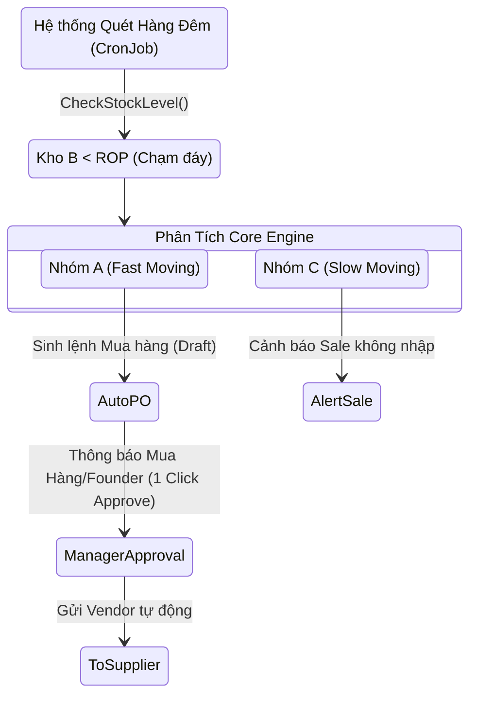
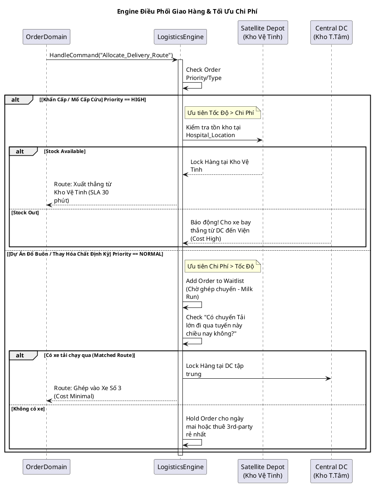
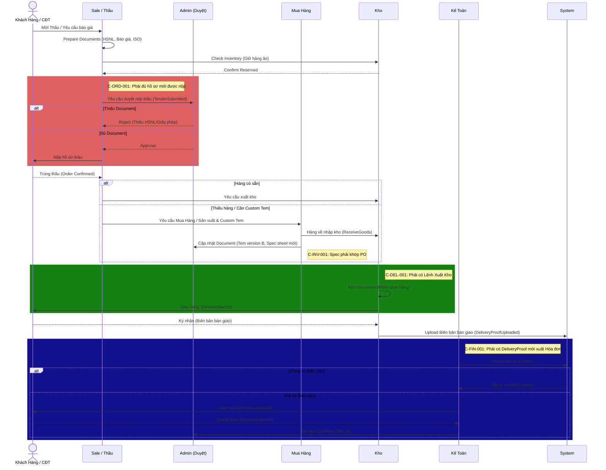

# 🔥 CORE SYSTEM BLUEPRINT: TỪ Ý ĐỊNH ĐẾN SỰ KIỆN (THE BUSINESS OS)

> **Axiom (Tiên đề 1):** Event + Constraint = Physics.
> Command + Entity + Decision = System.
>
> **Axiom (Tiên đề 2):** Document là chứng từ (Proof) - chìa khóa mở cổng State.
> Đừng bắt user nhập liệu, hãy để họ "Confirm" gợi ý của máy (Intelligence).
>
> **📌 Model Reference:** Toàn bộ State Machine, Constraint, Entity spec được định nghĩa tại `model/`. Tài liệu này chỉ giải thích **tại sao** hệ thống cần vận hành theo cách đó.

---

## 0. 🧠 KNOWLEDGE LAYER (LỚP TRÍ TUỆ - TRƯỚC KHI CÓ ĐƠN)

Nhiệm vụ: Biến Text thô & File bẩn thành Data có thể query.

### Tại sao cần lớp này?

Ngành TBYT có đặc thù: cùng 1 sản phẩm nhưng **mỗi bệnh viện gọi khác nhau**, mỗi gói thầu viết spec khác nhau. Nếu không normalize, Sale phải ngồi đọc PDF thầu rồi tra cứu bằng mắt → sai sót, chậm.

- **Product Knowledge (3 tầng):** `Raw Name` → `JSON Spec` → `Canonical Product`. Ref: [entities.yaml → CanonicalProduct, Product](../model/entities.yaml)
- **Tender Intelligence:** Input đa định dạng (PDF, Excel, Word, Ảnh) → Normalize bằng LLM → Vector search ngữ nghĩa → Confidence scoring (Xanh/Vàng/Đỏ). Ref: [entities.yaml → Tender, TenderItem](../model/entities.yaml)

---

## 1. 🟩 DEMAND & CONTRACT LAYER (Đấu Thầu & Hợp Đồng)

### Tại sao layer này quan trọng?

DVT bán hàng qua 2 kênh: **đấu thầu công** (chiếm ~60% doanh thu, quy trình nặng chứng từ) và **thương mại trực tiếp** (nhanh hơn, bỏ qua bước thầu). Hệ thống phải xử lý cả 2 trên cùng 1 entity `Order` mà không phá vỡ flow.

**Entity Owner:** `Order` — Ref: [entities.yaml → Order](../model/entities.yaml)

### State Machine & Commands

- **State Machine đầy đủ:** Xem [states.yaml → Order](../model/states.yaml)
- **Constraints áp dụng (Order / thầu):** `C-ORD-001` … `C-ORD-008`. **Sau trúng thầu (SupplyOrder):** `C-SUP-001`. Xem [constraints.yaml](../model/constraints.yaml)

### Context nghiệp vụ (không có trong Model)

- **SubmitTender:** Lúc nộp thầu, Intelligence OS phải cross-check cert sản phẩm vs yêu cầu thầu. Đây là bước tiết kiệm nhất vì phát hiện sớm thiếu ISO/FSC → tránh nộp thầu rồi trúng mà không giao được hàng.
- **ConfirmContract:** Credit limit check tự động. Founder không muốn Sale chốt đơn rồi khách quỵt — hệ thống phải chặn trước khi cam kết.
- **CloseContract:** Thanh lý là bước closing pháp lý. Sau state này, mọi entity liên quan thành read-only. Không ai sửa được.

---

## 2. 🟨 INVENTORY LAYER (ĐIỀU PHỐI HÀNG HÓA TỰ ĐỘNG)

### Tại sao cần "bể chứa thông minh"?

Kho DVT không phải kho bán lẻ — hàng TBYT có lô, hạn dùng, cert đi kèm. Việc "ai được lấy lô nào" phải do hệ thống quyết định, không phải nhân viên kho chọn tay. Sai một lô = sai cert = khách trả hàng = mất thầu.

**Entity Owner:** `InventoryLot` — Ref: [entities.yaml → InventoryLot](../model/entities.yaml)

### State Machine & Commands (Inventory)

- **State Machine đầy đủ:** Xem [states.yaml → InventoryLot](../model/states.yaml)
- **Constraints áp dụng:** `C-INV-001` … `C-INV-006`. Xem [constraints.yaml](../model/constraints.yaml)

### Context nghiệp vụ (Inventory)

- **Priority Engine:** Rank 1 (Critical - mổ khẩn cấp, SLA < 24h) > Rank 2 (Contract - thầu định kỳ) > Rank 3 (Retail - bán lẻ). Khi hàng Critical cạn → kích hoạt lệnh Mua Hàng khẩn cấp.
- **Auto-Release:** Order om hàng quá X ngày mà không ship → hệ thống tự unlock. X cấu hình theo từng khách (VIP = lâu hơn).

---

## 3. 🟥 DELIVERY LAYER (Giao Nhận Thực Địa)

### Tại sao giao hàng TBYT phức tạp?

Giao cho bệnh viện ≠ giao cho đại lý. Bệnh viện yêu cầu biên bản mộc đỏ, nghiệm thu kỹ thuật, GPS đúng trạm. Mất 1 biên bản = không xuất được VAT = tiền treo vô thời hạn.

**Entity Owner:** `Delivery` — Ref: [entities.yaml → Delivery](../model/entities.yaml)

### State Machine & Commands (Delivery)

- **State Machine đầy đủ:** Xem [states.yaml → Delivery](../model/states.yaml)
- **Constraints áp dụng:** `C-DEL-001` → `C-DEL-003`. Xem [constraints.yaml](../model/constraints.yaml)

---

## 4. 🟪 CASHFLOW LAYER (Dòng Máu Công Ty)

### Tại sao Finance là layer cuối cùng?

Triết lý: **Tiền chỉ được phép chảy khi chứng từ thực địa đã hoàn tất.** Đây là luật sắt chống "hóa đơn lụi" (xuất VAT trước khi giao hàng) — hành vi gây rủi ro thuế cực lớn cho DVT.

**Entity Owner:** `Invoice` & `Ledger` — Ref: [entities.yaml → Invoice, Ledger](../model/entities.yaml)

### State Machine & Commands (Cash)

- **State Machine đầy đủ:** Xem [states.yaml → Invoice](../model/states.yaml)
- **Constraints áp dụng:** `C-FIN-001` → `C-FIN-003`. Xem [constraints.yaml](../model/constraints.yaml)

### Context nghiệp vụ (Cash)

- **MISA Integration:** Core System là Master. Kế toán chỉ bấm xuất hóa đơn trên Core → API tự động gọi `MisaInvoiceAdapter.issue()`. Phân quyền trên MISA bị chặn tạo thủ công.
- **Bank Webhook (Auto-Reconciliation):** Ngân hàng cấp Virtual Account (`9999 + Contract_Code`). POST webhook → quét VA → tự động đối soát giảm trừ nợ hợp đồng mà không cần kế toán nhập tay.

---

## 4b. 🟧 POST-AWARD EXECUTION & COMMERCIAL LAYER

### Tại sao tách layer này?

Một `Order` vẫn là aggregate root, nhưng **sau trúng thầu** cần thêm: **issue/change có owner & ETA** (thay chat rời), **mốc thu tiền + payment readiness**, **cash plan ngắn hạn** (cảnh báo gap vốn), **bảng giá theo kênh** (giảm bottleneck founder), **touchpoint sales** (handover khi đổi người). Các thực thể này gắn FK vào `Order` / `OrderItem` / `LegalEntity` — không nhân đôi luồng `Order` state machine.

**Tham chiếu model:** [entities.yaml → ExecutionIssue, PaymentMilestone, CashPlanEvent, PriceList, PriceListItem, SalesTouchpoint](../model/entities.yaml) · [states.yaml → ExecutionIssue](../model/states.yaml) · Constraints `C-EXE-*`, `C-AR-001`, `C-PR-001`, `C-INV-006` trong [constraints.yaml](../model/constraints.yaml).

### Ánh xạ pain ngành ↔ model (một nguồn, tránh trùng ý với ERP đầy đủ)

| Pain | Neo trong model / rule |
| --- | --- |
| Lô, hạn dùng, FEFO, trace | `InventoryLot` (`expiry_date`, `batch_no`), Reserve ưu tiên FEFO, `C-INV-006` |
| Giá BV / đại lý / volume | `PriceList`, `PriceListItem`, `Partner.segment`, `OrderItem.price_list_item_id`, `C-PR-001` |
| Công nợ, invoice nhỏ, aging | `Invoice.payment_due_date`, cache trên `Partner`, `C-AR-001`, khóa đơn `C-ORD-005` |
| Forecast nhập (ROP, ABC) | `Product` + `C-INV-004` (đã có trong Planning) |
| Sales đi thị trường | `SalesTouchpoint` |
| Thực thi sau trúng (trễ NCC, thiếu CQ, gap vốn) | `ExecutionIssue`, `OrderItem` line risk & dates, `PaymentMilestone`, `CashPlanEvent`, `C-EXE-*` |

---

## 5. 🧠 ENGINEERING CORE: TRIẾT LÝ VẬN HÀNH

Backend chạy theo "Phản ứng dây chuyền", không phải "Update dữ liệu":

1. **Controller** nhận `Command`.
2. **Rule Engine** check `Constraints` — Ref: toàn bộ [constraints.yaml](../model/constraints.yaml).
3. **Entity** nhảy State → Ghi Audit Log.
4. **EventBus** bắn tin cho các Domain khác thực thi nhiệm vụ phái sinh.

**Virtual File System:** File nằm im trên S3. Toàn bộ trạng thái & ngữ cảnh nằm ở DB. Rollback hay tag lỗi file chỉ là "đổi cờ" trong DB, không di chuyển bytes.

## ⚙️ PLANNING & LOGISTICS ENGINE (DỰ BÁO TỒN KHO & TỐI ƯU LOGISTICS)

> **📌 Model Reference:** Entity, Constraint tham chiếu tại `model/`. Tài liệu này giải thích **chiến lược vận hành** — tại sao hệ thống cần chủ động (Proactive) thay vì thụ động (Reactive).

---

### 1. 🧮 BÀI TOÁN TỒN KHO (AUTO-REORDER & TURNOVER OPTIMIZATION)

### Tại sao không thể chờ Sale báo hết hàng?

DVT kinh doanh wholesale TBYT — lead time nhập hàng từ NCC nước ngoài có thể 30-60 ngày. Nếu chờ hết hàng mới mua → mất thầu liên tục. Hệ thống phải tự quét tồn kho và ra lệnh mua trước.

#### 1.1 Phân loại Hàng hóa (ABC Analysis)

> Ref: [entities.yaml → Product.abc_class](../model/entities.yaml)

| Nhóm | Đặc điểm | Chiến lược tồn kho |
| --- | --- | --- |
| **A (Fast-Moving)** | Stent thông dụng, hóa chất sinh hóa. 80% doanh thu, 20% SKU. | Safety stock cao. Hệ thống tự đẩy PO khi chạm ROP. |
| **B (Medium-Moving)** | Lưới thoát vị, dụng cụ thay khớp. | Thuật toán gợi ý, Founder duyệt tay. |
| **C (Slow-Moving)** | Máy thở chuyên dụng, MRI. | **Make-to-Order.** Safety stock = 0. Chỉ nhập khi có `OrderConfirmed`. |

#### 1.2 Công thức hệ thống

> ROP sử dụng `PARTNER.lead_time_days` (ref: [entities.yaml → Partner](../model/entities.yaml)) + `PRODUCT.safety_stock`.

- **Reorder Point (ROP):** `(Lead_Time × Avg_Daily_Demand) + Safety_Stock`
- **Max Inventory Limit:** Ngưỡng khóa — không cho mua thêm để tránh dead stock.
- **CronJob đêm:** Hệ thống quét mỗi đêm. Khi stock < ROP → kích hoạt constraint `C-INV-004`.

#### 1.3 Luồng Tự Động Hóa Mua Hàng

---

### 2. 🚛 BÀI TOÁN TỐI ƯU CHI PHÍ VẬN TẢI

### Tại sao phải tính toán "Kho nào xuất" và "Xe nào đi"?

Volume lớn + margin mỏng. Bù lỗ 1 chặng giao lẻ tẻ = bay toàn bộ lợi nhuận đơn đó.

#### 2.1 Cấu trúc Mạng Lưới Kho (Hub & Spoke)

> Ref: [entities.yaml → Warehouse](../model/entities.yaml). DB field: `WAREHOUSE.type = DC / Satellite_Depot`.

| Loại kho | Vị trí | Vai trò |
| --- | --- | --- |
| **DC (Distribution Center)** | Ngoại ô, mặt bằng rẻ | Trữ lô lớn (bulk). Xuất cho đơn gom chuyến. |
| **Satellite Depot** | Sát bệnh viện | Dự phòng safety stock 3 ngày. Chỉ phục vụ đơn cấp cứu. |

#### 2.2 Thuật toán Gom Chuyến (Routing Cost Optimization)

#### 2.3 Gating Constraints

> Ref đầy đủ tại [constraints.yaml](../model/constraints.yaml)

| Constraint ID | Mục đích | Tóm tắt |
| --- | --- | --- |
| `C-INV-003` | Chống hụt hàng cấp cứu | Satellite Depot chỉ dành cho bệnh viện. Đại lý KHÔNG được rút. |
| `C-INV-005` | Đảm bảo tính pháp lý thầu | Thông số tinh chỉnh (refined_spec) phải khớp yêu cầu thầu và đủ tem phụ. |
| `C-DEL-003` | Chống lãng phí vận tải | Cấm xuất xe bán tải 1 đơn < 1 CBM từ DC (trừ cấp cứu). Phải gom Milk-Run. |

---

### 📌 DB TABLE MAPPING (Tham chiếu ERD)

> Chi tiết: Entity specs: [entities.yaml](../model/entities.yaml)

| Nghiệp vụ | Bảng DB |
| --- | --- |
| Phân nhóm ABC, Safety Stock, ROP | `Product.abc_class`, `Product.safety_stock` |
| Lead Time theo NCC | `Partner.lead_time_days` |
| Kho DC / Kho Vệ Tinh | `Warehouse.type` |
| Mua hàng nhập vào kho nào | `SupplyOrder.target_warehouse_id` |
| Chuyến gom xe (Milk Run) | `Vehicle`, `DeliveryRoute` |
| GPS chống giao nhầm | `Delivery.gps_coordinates_actual` |
| Xuất từ kho nào | `Delivery.source_warehouse_id` |

## HỆ THỐNG ĐIỀU HÀNH (EXECUTION PIPELINE)

> **📌 Model Reference:** State Machine tại [states.yaml](../model/states.yaml), Constraints tại [constraints.yaml](../model/constraints.yaml).
> Diagram này thể hiện **thứ tự tương tác giữa các Domain** — bổ sung cho state machine (1 entity) và sequence diagram (actors).

```plantuml
@startuml ERP_Execution_Flow
skinparam maxMessageSize 150
skinparam ParticipantPadding 20
skinparam BoxPadding 10

title ERP Execution Flow (Command-driven & Event-sourced)

actor User
boundary "Front-End\n(FE)" as FE

box "Core" #LightCyan
participant "IAM" as IAM
participant "Audit" as Audit
end box

box "Domain" #LightYellow
participant "OrderDomain" as OrderDomain
participant "ProcurementDomain" as ProcurementDomain
participant "InventoryDomain" as InventoryDomain
participant "DeliveryDomain" as DeliveryDomain
participant "CashDomain" as CashDomain
end box

box "Infra" #LightGreen
participant "Docs\n(Constraint Engine)" as Docs
participant "EventBus" as EventBus
end box

== 1. COMMAND: Create Order ==
User -> FE: Click Create Order
activate FE
FE -> OrderDomain: HandleCommand("Khởi tạo đơn")
activate OrderDomain
OrderDomain -> Docs: Upload(docs, "Order", OrderID)
OrderDomain -> OrderDomain: ValidateSchema()
OrderDomain -> OrderDomain: ChangeState("Draft")
OrderDomain -> EventBus: Publish("Order (Draft)")
FE <-- OrderDomain: Return Success
deactivate OrderDomain
deactivate FE

== 2. COMMAND: Confirm Order [C-ORD-003] ==
User -> FE: Click Confirm Order
activate FE
FE -> OrderDomain: HandleCommand("ConfirmContract")
activate OrderDomain

OrderDomain -> Docs: Check("signed_contract")
Docs --> OrderDomain: status

alt status == Missing
    FE <-- OrderDomain: Error("Thiếu hợp đồng")
else status == OK
    OrderDomain -> OrderDomain: CheckCreditLimit()
    
    alt Limit Exceeded
        FE <-- OrderDomain: Error("Vượt hạn mức tín dụng")
    else Limit OK
        OrderDomain -> OrderDomain: ChangeState("ContractSigned")
        OrderDomain -> EventBus: Publish("ContractSigned")
        FE <-- OrderDomain: Return Success
    end
end
deactivate OrderDomain
deactivate FE

== 3. EVENT DRIVEN: Reserve Inventory ==
EventBus -> InventoryDomain: On("OrderConfirmed")
activate InventoryDomain
InventoryDomain -> InventoryDomain: HandleCommand("ReserveInventory")

InventoryDomain -> InventoryDomain: CheckStock()

alt qty < required
    InventoryDomain -> InventoryDomain: EmitCommand("RequestProcurement")
    EventBus <-- InventoryDomain: Error("Không đủ hàng")
else qty >= required
    InventoryDomain -> InventoryDomain: RunAllocationStrategy()
    InventoryDomain -> InventoryDomain: ChangeState("Reserved")
    InventoryDomain -> EventBus: Publish("InventoryReserved")
end
deactivate InventoryDomain

== 4. COMMAND: Start Delivery [C-DEL-001] ==
User -> FE: Click Start Delivery
activate FE
FE -> DeliveryDomain: HandleCommand("StartDelivery")
activate DeliveryDomain

DeliveryDomain -> Docs: Check("delivery_note")
Docs --> DeliveryDomain: status

alt status == Missing
    FE <-- DeliveryDomain: Error("Thiếu phiếu giao")
else status == OK
    DeliveryDomain -> DeliveryDomain: VerifyInventoryReserved()
    DeliveryDomain -> DeliveryDomain: ChangeState("Dispatched")
    DeliveryDomain -> EventBus: Publish("DeliveryStarted")
    FE <-- DeliveryDomain: Return Success
end
deactivate DeliveryDomain
deactivate FE

== 5. COMMAND: Issue Invoice [C-FIN-001] ==
User -> FE: Click Issue Invoice
activate FE
FE -> CashDomain: HandleCommand("IssueInvoice")
activate CashDomain

CashDomain -> DeliveryDomain: CheckState()
DeliveryDomain --> CashDomain: state

alt state != Delivered
    FE <-- CashDomain: Error("Chưa giao hàng")
else state == Delivered
    CashDomain -> Docs: Check("handover_minutes")
    CashDomain -> CashDomain: CreateInvoice()
    CashDomain -> EventBus: Publish("IssueInvoice")
    FE <-- CashDomain: Return Success
end
deactivate CashDomain
deactivate FE

== 6. EXCEPTION: Inbound Spec Mismatch [C-INV-001] ==
User -> FE: Click Receive Goods
activate FE
FE -> InventoryDomain: HandleCommand("ReceiveGoods")
activate InventoryDomain

InventoryDomain -> ProcurementDomain: MatchPurchaseOrder()
ProcurementDomain --> InventoryDomain: SpecResult

alt SpecResult == Mismatch
    InventoryDomain -> Audit: Log("Inbound Rejected - Spec Mismatch")
    FE <-- InventoryDomain: Error("Sai quy cách. Cần sửa PO hoặc gọi Admin Ghi đè.")

    == 6.1 CORRECTION: Revise Purchase Order (Purchaser) ==
    User -> FE: Click Revise PO
    FE -> ProcurementDomain: HandleCommand("RevisePO")
    activate ProcurementDomain
    ProcurementDomain -> Docs: AuditOldStatus()
    ProcurementDomain -> ProcurementDomain: CreateNewVersion()
    ProcurementDomain -> EventBus: Publish("PO_Revised")
    FE <-- ProcurementDomain: Return Success
    deactivate ProcurementDomain

    == 6.2 CORRECTION: Admin Waiver Quarantine (Founder) ==
    User -> FE: Click Force Receive
    FE -> IAM: CheckRole("Founder")
    IAM --> FE: Role = OK
    FE -> InventoryDomain: HandleCommand("ForceReceiveGoods")
    InventoryDomain -> InventoryDomain: ChangeState("Quarantined")
    InventoryDomain -> EventBus: Publish("GoodsReceived_Quarantined")
    InventoryDomain -> Audit: Log("Admin Bypass Inbound Spec")
    FE <-- InventoryDomain: Return Success

else SpecResult == Match
    InventoryDomain -> InventoryDomain: ChangeState("Available")
    InventoryDomain -> EventBus: Publish("ReceiveGoods")
    FE <-- InventoryDomain: Return Success
end
deactivate InventoryDomain
deactivate FE

== 7. EXCEPTION: Cancel & Reissue E-Invoice [C-FIN-002] ==
User -> FE: Click Modify Invoice
activate FE
FE -> CashDomain: HandleCommand("CancelAndReissue")
activate CashDomain

CashDomain -> CashDomain: CheckState("Issued")
CashDomain -> Docs: AuditOldStatus("InternalBilling")
CashDomain -> CashDomain: ChangeState("Voided")

CashDomain -> CashDomain: CreateNewInvoice("Draft_Reissue")
CashDomain -> EventBus: Publish("InternalBilling_Reissued")
FE <-- CashDomain: Return Success ("Vui lòng nhập lại số MISA mới")

deactivate CashDomain
deactivate FE

@enduml
```

## SEQUENCE DIAGRAM CỐT LÕI (Bao gồm Document Constraints)

> **📌 Model Reference:** Constraints chi tiết tại [constraints.yaml](../model/constraints.yaml).
> Diagram này minh họa **thứ tự tương tác giữa actors** — bổ sung cho state machine (thể hiện logic 1 entity).

## 🗄️ DATABASE ERD & SINGLE SOURCE OF TRUTH

> **📌 Model Reference:** Entity definitions tại [entities.yaml](../model/entities.yaml), quan hệ tại [relations.yaml](../model/relations.yaml).
> ERD diagram dưới đây là **phiên bản render** từ Model. Khi cập nhật schema, sửa YAML trước rồi cập nhật diagram.

```mermaid
erDiagram
    %% Nguồn sự thật: model/entities.yaml + model/relations.yaml — cập nhật đồng bộ.
    %% Core và Master Data
    LegalEntity {
        string id PK
        string name
        string tax_code
    }
    User {
        string id PK
        string role
        string legal_entity_id FK
    }
    Partner {
        string id PK
        string type "Customer Supplier"
        string name
        string credit_limit
        int lead_time_days
        string segment "Hospital Dealer Clinic"
        decimal outstanding_balance_cached
        int max_overdue_days_cached
    }
    Product {
        string id PK
        string sku
        string standard_spec
        string customized_spec
        string abc_class
        int safety_stock
    }
    Warehouse {
        string id PK
        string type "DC Satellite_Depot"
        string name
        string location
    }
    Document {
        string id PK
        string type
        string file_url
        string related_entity_type
        string related_entity_id
        int version
        string status
    }
    Order {
        string id PK
        string legal_entity_id FK
        string order_type "Tender Commercial"
        string priority
        string virtual_account_no
        string execution_risk_level "Green Amber Red"
        string status "state machine Order"
    }
    OrderItem {
        string id PK
        string order_id FK
        string product_id FK
        string supplier_partner_id FK
        string price_list_item_id FK
        int quantity
        date committed_delivery_date
        string line_execution_status
        string line_risk_level
    }
    SupplyOrder {
        string id PK
        string legal_entity_id FK
        string type
        string target_warehouse_id FK
        string status
    }
    InventoryLot {
        string id PK
        string warehouse_id FK
        string product_id FK
        string batch_no
        date expiry_date
        string iso_cert
        int total_qty
    }
    InventoryReservation {
        string id PK
        string order_item_id FK
        string lot_id FK
        int reserved_qty
        timestamp locked_at
    }
    InventoryLedger {
        string id PK
        string action
        int qty_change
        timestamp created_at
    }
    Invoice {
        string id PK
        string legal_entity_id FK
        string order_id FK
        decimal total_amount
        string misa_transaction_id
        string replaced_by_invoice_id FK
        date payment_due_date
        int days_overdue_cached
        string status
    }
    Delivery {
        string id PK
        string order_id FK
        string source_warehouse_id FK
        string vehicle_id FK
        string route_type
        string gps_coordinates_actual
        string status
        string tracking_code
    }
    Vehicle {
        string id PK
        string plate_no
        string type
        decimal max_capacity_cbm
    }
    DeliveryRoute {
        string id PK
        string vehicle_id FK
        date route_date
        string status
    }
    Ledger {
        string id PK
        string legal_entity_id FK
        string type
        decimal amount
        string related_ledger_id FK
        string partner_id FK
    }
    AuditLog {
        string id PK
        string user_id FK
        string action
        string entity_type
        string entity_id
        json old_payload
        json new_payload
        timestamp created_at
    }
    Tender {
        string id PK
        string tender_code
        string raw_text
        string document_id FK
        string status
    }
    TenderItem {
        string id PK
        string tender_id FK
        string raw_requirement
        string matched_product_id FK
    }
    CanonicalProduct {
        string id PK
        string name
        jsonb canonical_spec
    }
    ProductAlias {
        string id PK
        string canonical_product_id FK
        string alias_name
    }
    Requirement {
        string id PK
        string type
        string description
    }
    ProductReqMapping {
        string product_id FK
        string requirement_id FK
    }
    TenderReqMapping {
        string tender_item_id FK
        string requirement_id FK
    }
    %% Post-award execution và Commercial (domain mới — đồng bộ entities.yaml)
    ExecutionIssue {
        string id PK
        string order_id FK
        string order_item_id FK
        string owner_user_id FK
        string issue_type
        string severity
        string impact_flags
        string status "Open InProgress PendingApproval Resolved Cancelled"
    }
    PaymentMilestone {
        string id PK
        string order_id FK
        string milestone_name
        date due_date
        decimal amount_planned
        string checklist_status
        boolean payment_ready
    }
    CashPlanEvent {
        string id PK
        string legal_entity_id FK
        string order_id FK
        date scheduled_date
        decimal amount
        string purpose
    }
    PriceList {
        string id PK
        string legal_entity_id FK
        string partner_id FK
        string channel
        string name
        date valid_from
        date valid_to
    }
    PriceListItem {
        string id PK
        string price_list_id FK
        string product_id FK
        decimal unit_price
        int min_qty
        string currency
    }
    SalesTouchpoint {
        string id PK
        string partner_id FK
        string order_id FK
        string created_by_user_id FK
        string activity_type
        timestamp occurred_at
        string summary
    }
    %% Return và Transfer (đồng bộ entities.yaml)
    ReturnOrder {
        string id PK
        string order_id FK
        string status
        decimal total_refund_amount
    }
    ReturnLineItem {
        string id PK
        string return_order_id FK
        string lot_id FK
        int quantity
    }
    StockTransfer {
        string id PK
        string source_warehouse_id FK
        string dest_warehouse_id FK
        string status
    }
    StockTransferLine {
        string id PK
        string stock_transfer_id FK
        string lot_id FK
        int quantity
    }

    %% ------ Quan hệ: mirror relations.yaml ------
    LegalEntity ||--o{ Order : owns
    LegalEntity ||--o{ SupplyOrder : owns
    LegalEntity ||--o{ Invoice : owns
    LegalEntity ||--o{ Ledger : owns
    LegalEntity ||--o{ CashPlanEvent : owns
    LegalEntity ||--o{ PriceList : owns

    Partner ||--o{ Order : customer_places
    Partner ||--o{ SupplyOrder : supplier_fulfills
    Partner ||--o{ OrderItem : supplier_line
    Partner ||--o{ PriceList : price_for_partner
    Partner ||--o{ SalesTouchpoint : touchpoints

    Product ||--o{ OrderItem : line_product
    Product ||--o{ InventoryLot : stocked_as
    Product ||--o{ PriceListItem : priced_in

    Order ||--|{ OrderItem : contains
    Order ||--|| Invoice : triggers_invoice
    Order ||--o{ Delivery : deliveries
    Order ||--o{ Document : documents
    Order ||--o{ SupplyOrder : triggers_supply
    Order ||--o{ ReturnOrder : returns
    Order ||--o{ ExecutionIssue : execution_issues
    Order ||--o{ PaymentMilestone : payment_milestones
    Order ||--o{ CashPlanEvent : cash_events
    Order ||--o{ SalesTouchpoint : touchpoints

    OrderItem ||--o{ InventoryReservation : locks
    OrderItem ||--o{ ExecutionIssue : issue_targets
    OrderItem }o--o| PriceListItem : price_row

    SupplyOrder ||--o{ InventoryLot : receives_inbound
    Warehouse ||--o{ InventoryLot : stores
    Warehouse ||--o{ Delivery : ships_from
    Warehouse ||--o{ StockTransfer : transfer_source_or_dest

    InventoryLot ||--o{ InventoryReservation : held_in
    InventoryLot ||--o{ InventoryLedger : ledger_moves
    InventoryLot ||--o{ Delivery : fulfilled_via
    InventoryLot ||--o{ ReturnLineItem : return_from_lot

    Invoice ||--o{ Ledger : settled_by
    Invoice ||--o{ Document : documents
    ReturnOrder ||--|| Invoice : credit_note

    Delivery ||--o{ DeliveryRoute : batched_into
    Vehicle ||--o{ DeliveryRoute : runs

    Product ||--o{ Document : product_docs
    User ||--o{ AuditLog : audit
    User ||--o{ ExecutionIssue : issue_owner
    User ||--o{ SalesTouchpoint : touchpoint_author

    PriceList ||--|{ PriceListItem : contains

    ReturnOrder ||--|{ ReturnLineItem : lines
    StockTransfer ||--|{ StockTransferLine : lines
    StockTransferLine }o--|| InventoryLot : lot

    CanonicalProduct ||--o{ Product : standardizes
    CanonicalProduct ||--o{ ProductAlias : aliases
    Product ||--o{ ProductReqMapping : satisfies
    Requirement ||--o{ ProductReqMapping : applied_to_product
    Tender ||--o{ TenderItem : contains
    TenderItem ||--o| Product : matched_to
    TenderItem ||--o{ TenderReqMapping : strictly_requires
    Requirement ||--o{ TenderReqMapping : applied_to_tender
```

> **Ghi chú:** ERD trên gom **mối** `Partner → Order` (khách) và `Partner → OrderItem` (NCC dòng) vào cùng một thực thể `Partner` — `type` phân biệt Customer/Supplier. Chi tiết cột và FK trong `entities.yaml`.

---

### DOMAIN OWNERSHIP (Tham chiếu từ Model)

> Bảng dưới tóm tắt "Ai sở hữu entity nào". Chi tiết đầy đủ tại [entities.yaml](../model/entities.yaml).

| Domain | Source of Truth | Actor (Owner) | Ý nghĩa |
| --- | --- | --- | --- |
| **Demand** | `Order` | Sale / Đấu Thầu | Trigger nhận Order, đòi hàng. Event: `ConfirmContract`. |
| **Supply** | `SupplyOrder` | Procurement | Sourcing, nhập hàng, chứng từ NCC. Sinh `InventoryLot`. |
| **Inventory** | `InventoryLot` | Warehouse | Giám sát lô hàng. Event: `InventoryReserved`. |
| **Delivery** | `Delivery` | Logistics / CSKH | Mang hàng đến khách. Event: `StartDelivery`. |
| **Cash** | `Ledger` | Finance / Founder | Giữ ví, phân bổ tiền. Event: `RegisterPayment`. |
| **PostAward** | `ExecutionIssue`, `PaymentMilestone`, `CashPlanEvent` | Sale / Finance / PM | Issue log, mốc thu, chi ngắn hạn; risk rollup lên `Order`. |
| **Commercial** | `PriceList`, `PriceListItem` | Admin | Bảng giá đa kênh; `OrderItem` tham chiếu dòng giá. |

---

## 📋 ENTITY & COMMAND REGISTRY INDEX

> **📌 Mục đích:** Bảng tham chiếu nhanh toàn bộ Entity và Command (Event) của hệ thống. Spec đầy đủ tại `model/`. Đây là index giúp Dev tra cứu nhanh domain sở hữu, bảng DB tương ứng, và command khả dụng.

### Entity Index (Toàn bộ Aggregate & Data Model)

| Entity ID | Domain | DB Table | Vai trò |
| --- | --- | --- | --- |
| `Order` | Demand | `Order` | Aggregate root — quản lý vòng đời giao dịch từ Lead → Thanh lý |
| `OrderItem` | Demand | `OrderItem` | Dòng hàng trong Order; đầu vào của `InventoryReservation` |
| `Tender` | Demand | `Tender` | Gói thầu nhập từ muasamcong; Intelligence OS phân tích |
| `TenderItem` | Demand | `TenderItem` | Dòng yêu cầu kỹ thuật trong Tender; được match với Product |
| `SupplyOrder` | Supply | `SupplyOrder` | Lệnh mua hàng / sản xuất nội bộ; sinh `InventoryLot` khi hàng về |
| `InventoryLot` | Inventory | `InventoryLot` | Lô hàng vật lý (số lô, hạn dùng, cert); đơn vị Reserve & Dispatch |
| `InventoryReservation` | Inventory | `InventoryReservation` | Bản ghi lock số lượng từ `InventoryLot` cho `OrderItem` |
| `InventoryLedger` | Inventory | `InventoryLedger` | Sổ nhật ký thao tác kho append-only (IN/OUT/ADJUST/RESERVE) |
| `Delivery` | Delivery | `Delivery` | Chuyến giao hàng vật lý; điều kiện tiên quyết để `IssueInvoice` |
| `DeliveryRoute` | Delivery | `DeliveryRoute` | Tuyến Milk-Run gom nhiều Delivery trong cùng ngày |
| `Vehicle` | Delivery | `Vehicle` | Phương tiện; capacity CBM dùng kiểm tra constraint Milk-Run |
| `Invoice` | Cash | `Invoice` | Hóa đơn VAT điện tử; đẩy sang MISA qua API tự động |
| `Ledger` | Cash | `Ledger` | Sổ cái dòng tiền theo pháp nhân (Inflow/Outflow/Transfer) |
| `Product` | MasterData | `Product` | Sản phẩm chuẩn hóa; có ABC class và safety stock để tính ROP |
| `CanonicalProduct` | MasterData | `CanonicalProduct` | Thực thể chuẩn từ Intelligence OS; nhiều alias cùng trỏ vào |
| `ProductAlias` | MasterData | `ProductAlias` | Tên gọi thay thế của `CanonicalProduct` (free text từ hồ sơ thầu) |
| `Requirement` | MasterData | `Requirement` | Yêu cầu chứng nhận (ISO 13485, CE, FSC); dùng cross-check thầu |
| `Partner` | MasterData | `Partner` | Customer hoặc Supplier; có credit_limit và lead_time_days |
| `LegalEntity` | MasterData | `LegalEntity` | Pháp nhân nội bộ A/B/C/D; mọi Order/Invoice đều thuộc về |
| `Warehouse` | MasterData | `Warehouse` | Kho vật lý: DC (bulk) hoặc Satellite_Depot (cấp cứu) |
| `Document` | MasterData | `Document` | Chứng từ điện tử polymorphic; không xóa vật lý, chỉ đổi flag |
| `ExecutionIssue` | PostAward | `EXECUTION_ISSUE` | Sự cố/thay đổi sau trúng thầu; state machine riêng |
| `PaymentMilestone` | PostAward | `PAYMENT_MILESTONE` | Mốc thu tiền + checklist payment-ready |
| `CashPlanEvent` | PostAward | `CASH_PLAN_EVENT` | Mốc cần chi ngắn hạn (financing gap) |
| `PriceList` | Commercial | `PRICE_LIST` | Bảng giá theo kênh/pháp nhân/khách |
| `PriceListItem` | Commercial | `PRICE_LIST_ITEM` | Dòng giá SKU + bậc volume đơn giản |
| `SalesTouchpoint` | Demand | `SALES_TOUCHPOINT` | Hoạt động chạy khách — giảm phụ thuộc chat cá nhân |
| `User` | System | `User` | Người dùng; có role + legal_entity_id phân quyền dữ liệu |
| `AuditLog` | System | `AuditLog` | Nhật ký bất biến mọi thao tác (actor, action, payload cũ/mới) |

### Command Index (Toàn bộ Events / Commands của hệ thống)

| Command ID | Domain | Target Entity | Flow State |
| --- | --- | --- | --- |
| `SubmitTender` | Demand | `Order` | `Draft → BidSubmitted` |
| `AwardTender` | Demand | `Order` | `BidSubmitted → WonWaiting` |
| `ConfirmContract` | Demand | `Order` | `WonWaiting → ContractSigned` |
| `StartExecution` | Demand | `Order` | `ContractSigned → InExecution` |
| `ConfirmFulfillment` | Demand | `Order` | `InExecution → Fulfilled` |
| `RefineBatchSpec` | Inventory | `InventoryLot` | `Refining / Quarantined → Available` |
| `CloseContract` | Demand | `Order` | `Fulfilled → ContractClosed` |
| `AbandonTender` | Demand | `Order` | `Draft → Abandoned` |
| `ReceiveGoods` | Inventory | `InventoryLot` | `Receiving → Available` |
| `ForceReceiveGoods` | Inventory | `InventoryLot` | `Receiving → Quarantined` |
| `ReserveInventory` | Inventory | `InventoryLot` | `Available → Reserved` |
| `AutoReleaseReservation` | Inventory | `InventoryReservation` | `Reserved → Available` (CronJob) |
| `DisposeInventory` | Inventory | `InventoryLot` | `Available → Disposed` |
| `StartDelivery` | Delivery | `Delivery` | `Draft → Dispatched` |
| `DriverConfirmPickup` | Delivery | `Delivery` | `Dispatched → InTransit` |
| `CompleteDelivery` | Delivery | `Delivery` | `InTransit → Delivered` |
| `ReportPartialDelivery` | Delivery | `Delivery` | `InTransit → PartiallyDelivered` |
| `CompleteReplacementDelivery` | Delivery | `Delivery` | `PartiallyDelivered → Delivered` |
| `CancelDelivery` | Delivery | `Delivery` | `Dispatched → Cancelled` |
| `IssueInvoice` | Cash | `Invoice` | `Draft → Issued` |
| `CancelAndReissue` | Cash | `Invoice` | `Issued → Voided` |
| `RegisterPayment` | Cash | `Invoice` | `Issued → Paid` |
| `RegisterPartialPayment` | Cash | `Invoice` | `Issued → PartiallyPaid` |
| `CreateExecutionIssue` | PostAward | `ExecutionIssue` | `→ Open` |
| `UpdateExecutionIssue` | PostAward | `ExecutionIssue` | Theo state machine `ExecutionIssue` |
| `ResolveExecutionIssue` | PostAward | `ExecutionIssue` | `→ Resolved` |
| `CancelExecutionIssue` | PostAward | `ExecutionIssue` | `→ Cancelled` |
